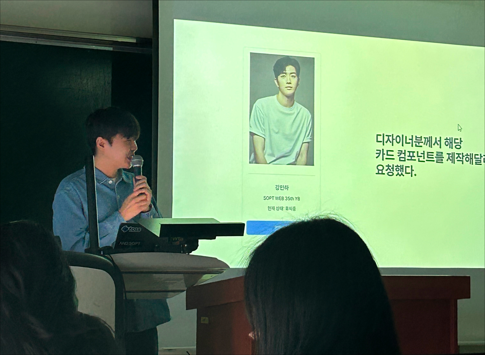
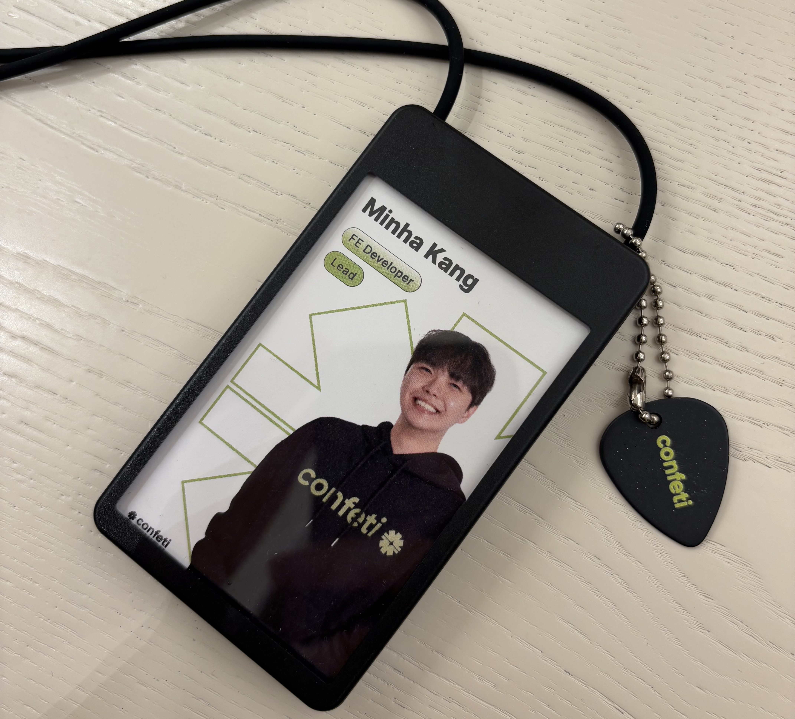
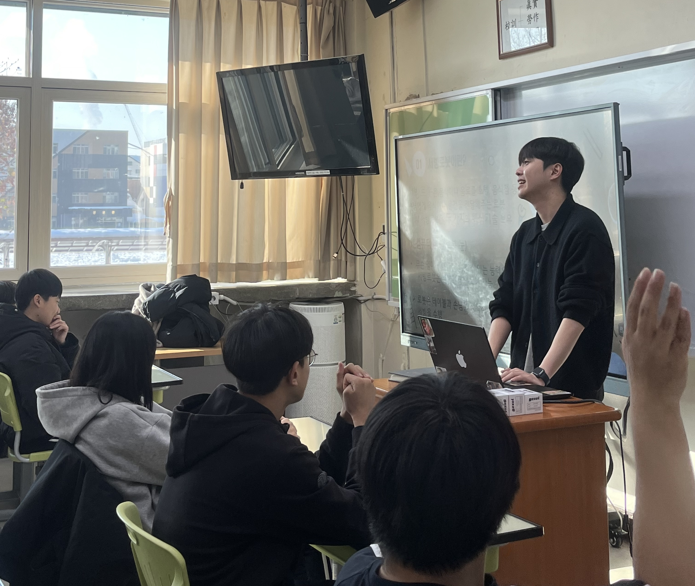
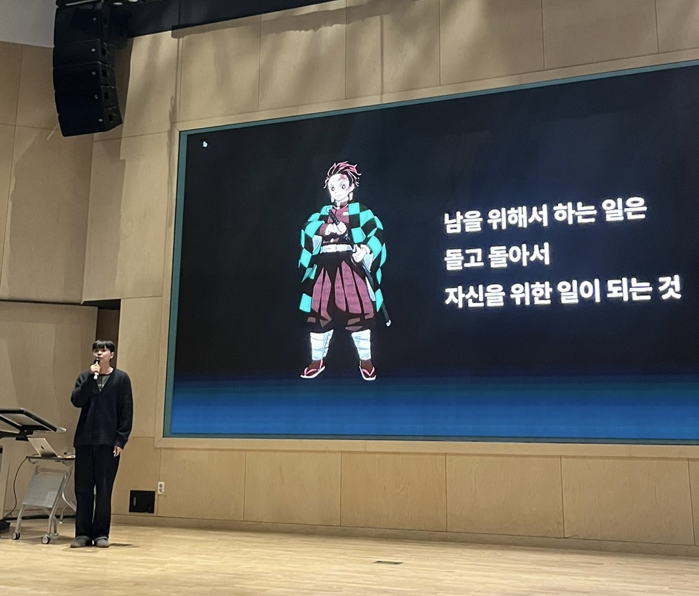
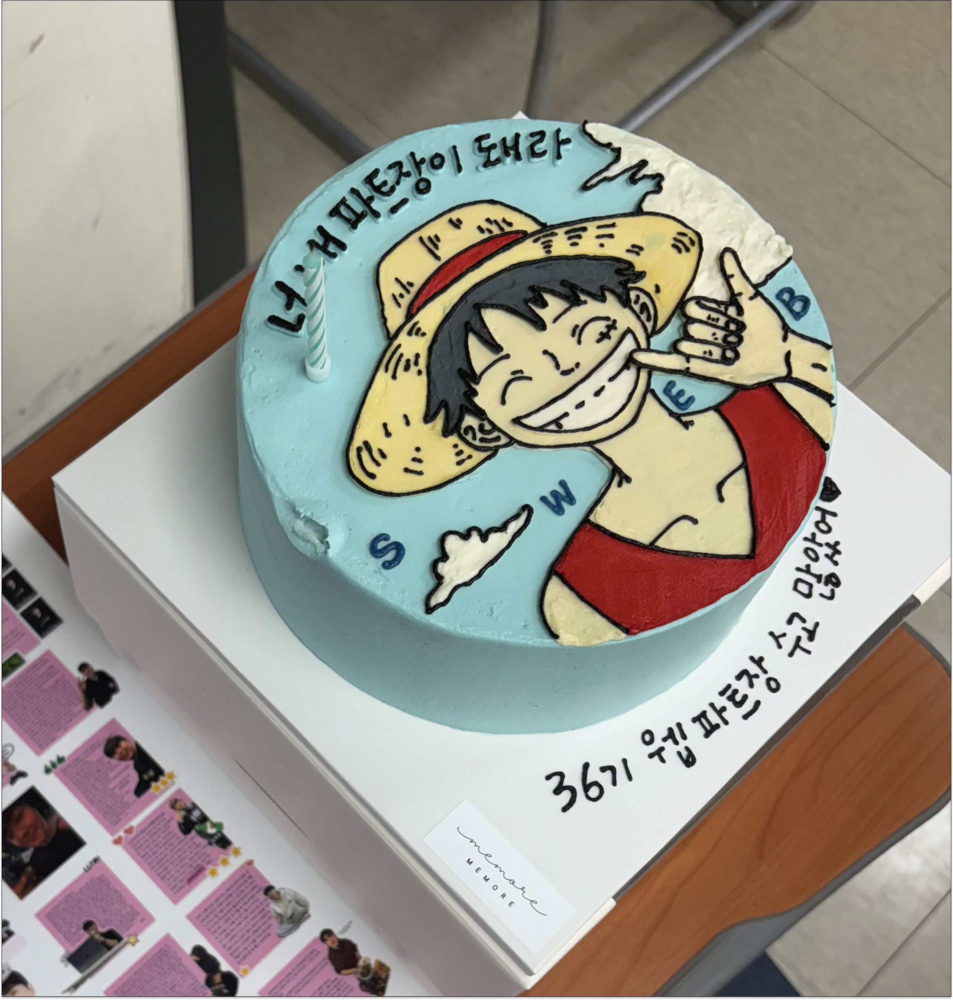
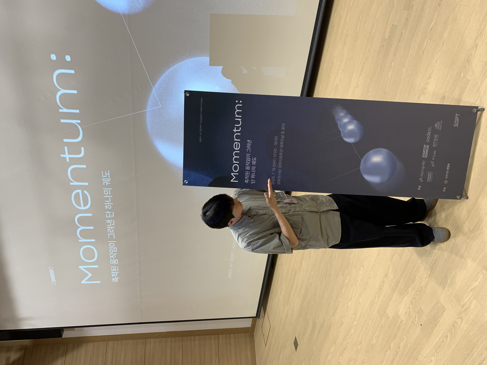
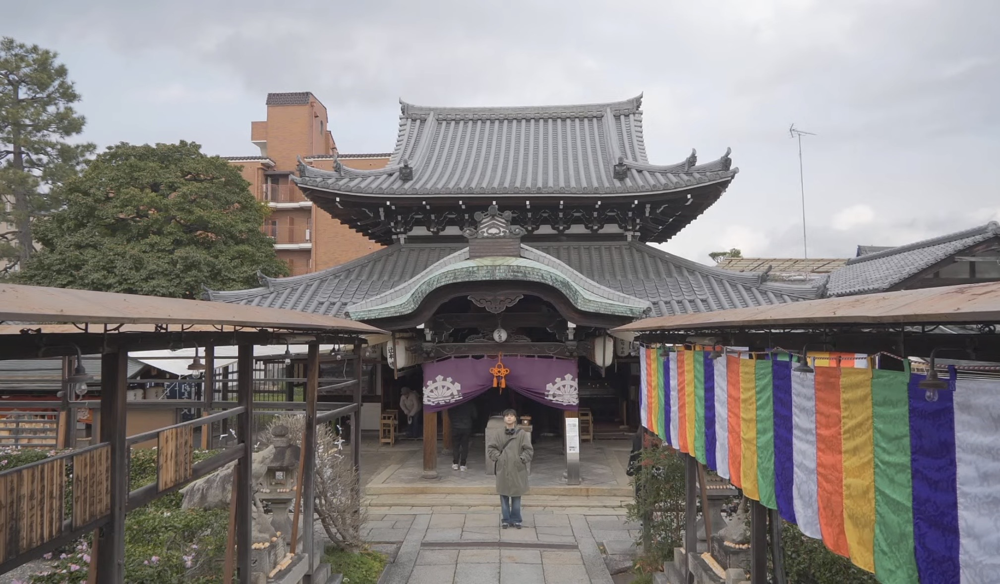
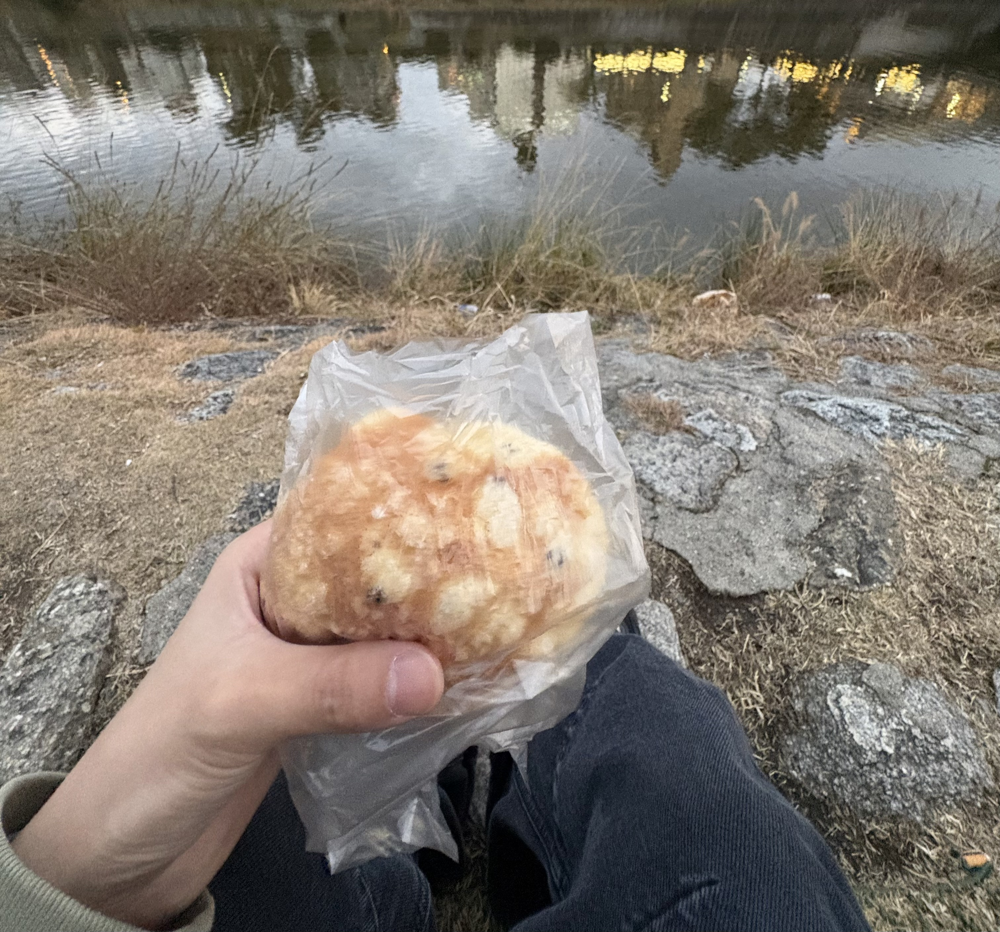

나에게 있어서 2025년은 꽤 의미 있었고 소중했던 연도라고 생각한다.

시간의 순서대로 간략하게 정리해 보자면

1. SOPT 35기를 수료했고,
2. 창업을 목표로 며칠간 밤새 코드만 바라보며 살아보았고,
3. 대학교도 졸업하고,
4. SOPT 36기 웹 파트장이 되었고,
5. 개발 행사도 주최해 보고,
6. 인턴에서부터 정규직까지의 여정...,
7. 그리고 대뜸 혼자 여행도 떠나보았다.

소중했던 25년을 떠나보내는 만큼 최대한 휘발되지 않고 기억을 간직해보고자

위에 적어둔 큰 목차(?)별로 간단하게 내 생각을 적어보려고 한다.

## 개발에 맛들이기 시작한 SOPT 35기

SOPT라는 동아리가 개발자라는 꿈을 확신하게 해준 계기가 되었다.

이전에는 학교에서 친구들과 개발하며 그저 높은 학점을 받고, 대회에서 수상하기 위한 목적으로 개발했었다.

그러다 보니 점점 목적이 희미해져 갔고 과연 이걸 내가 계속할 수 있을까에 대한 고민이 커져갔다.

그래서 24년 하반기에 SOPT 35기 웹 파트에 들어가게 되었다.

SOPT에서는 다들 지식 공유에 정말 진심이었다. 하나를 물어보면 10줄이 넘는 답변이 왔고, 모두가 개발을 정말로 사랑하는 사람들처럼 느껴졌다.

나도 그런 문화에 익숙해져갔고, 어느 순간 점점 개발을 즐겨 갔던 것 같다.

뜬금없지만 어려서부터 정답이 없는 토론(?)을 좋아했었다. 수학 문제를 빠르게 풀기보다는 다른 접근법은 없을지 끄적이는 걸 좋아했고, 더 지니어스 같은 서바이벌을 보며 필승법은 없을까 다음날 학교에서 친구들과 이야기 나누는게 좋았다. (그냥 완전 N임)

그런 의미에서 SOPT에서 개발에 재미를 붙이게 되었다.

코드 한 줄 한 줄에 의미를 부여하고, 더 좋은 방법은 없을까? 이건 어떨까? 동아리원들과 정답이 없는 토론을 밤새 나누는게 즐거웠다.

## 창업을 목표로 며칠간 밤새 코드만 바라보며 살았다

SOPT에서는 모든 교육을 마치고 나면 앱잼이라는 실전 프로젝트가 있다.

창업을 목표로 한 달 동안 프로덕트를 만들어 내게 된다. 그리고 2주간은 팀원이 모여 합숙하며 어떻게든 결과를 끌어내기 위해 노력한다.

당시에 아직 이렇다할 실전 경험도 없었지만 팀에서 프론트엔드 리드를 맡게 되었고, 팀과 팀원의 성장, 그리고 결과물을 내기 위해 꽤나 많이 노력했었다.

내가 사실 그렇게 이타적인 사람이 아닌데, 왜인지 정말 진심으로 팀원들이 많이 배워 가고 개발자로서 성장했으면 좋겠다는 마음이 엄청 컸었고 시간도 많이 썼다.

왜일까, 지금 생각해 보면 내가 개발에 재미를 붙였던 것처럼 소중한 사람들이 더 개발에 재미를 붙이고 더 성장했으면 어떨까 하는 마음가짐이 아니었을까 싶다.

like 몸에 좋은 음식이 있으면 싫다 해도 어떻게든 자식 입에 한입 먹여 주려는 아빠의 마음가짐..?? ㅋㅋ

2주간 합숙하며 물론 놀기도 재밌게 놀았지만, 모두가 하나가 되어 서비스를 만들어 나간다는 그 느낌이 좋았다.

디자이너와 투닥거리며 1px 하나하나 맞춰보고, 사소한 UX를 개선해보겠다고 밤을 새보며, 늦은 새벽에 터진 QA 버그 잡겠다고 해뜰때까지 앉아있던 그 책상의 공기 ... ㅋㅋ
모두가 다 좋은 추억이고 양분이 되었다.

아무튼 지금까지도 약 10명의 팀원들과 거의 1년간 프로젝트를 이어 나가고 있다. 이전에는 성장을 위해서 시간을 많이 썼다면, 이제는 진짜 창업을 목표로 열심히 해 보려고 한다. (될 때까지 해 보자)

## 드디어 졸업

군대에 있던 기간을 포함해서 약 6년간 다닌 내 학교와 자취 생활도 청산했다...

사실 거의 놀기만 했다. 너무 어려서 그냥 적당히 열심히 학점 받고 졸업하면 적당히 돈 벌고 살 수 있을 거라고 생각했던 것 같다. (근데 후회 없이 많이 놀기는 했다 ㅋ)

더 늦기 전에 개발 동아리들을 경험해 보며 진짜 내가 개발을 좋아하는지 확인해 볼 수 있어서 다행이었다.

아직 학교에 다니고 있는 후배들을 만나면 꼭 동아리 등의 외부 활동을 경험해 보기를 추천하고 있다.

그래도 나름 학교 다니는 동안 3년 정도 봉사단 활동을 하면서 SW 관련 교육 봉사를 많이 다녔는데, 지금와서 생각해보면 이때가 좀 기억에 많이 남는다.

## 어쩌다가 SOPT 36기 파트장

_첫 세미나인가? 다들 잘나왔으니까 모자이크는 생략할게요_

대학교 졸업을 앞두고, 앞으로 뭘 하며 살아가야 할지 많이 고민하던 시기가 있었다.

그때 내가 가장 즐거웠던 순간이 언제였는지를 떠올려 보니, 자연스럽게 SOPT에서의 시간이 떠올랐었다. 파트원들에게 도움을 주고, 내가 쌓아온 경험을 나누던 순간들. 누군가의 성장을 가까이에서 지켜보며 함께 고민하던 시간들이 소중했었다.

그래서 더 많은 사람들과 함께하고 싶다는 생각이 컸다. 개발자를 꿈꾸는 학생들에게 “개발이 진짜로 재미있을 수 있다”는 걸 알려 주고 싶었고, 그렇게 SOPT 36기 파트장에 지원했다.

**"남을 위해서 하는 일은 돌고 돌아서 자신을 위한 일이 되는 것 - 카마도 탄지로"**

파트장이 되고나서 처음 강단에서 했던 말이다. 사실 웃기라고 준비한거긴 한데, 지금 생각해보면 맞는말인 것 같다.

파트장은 하고 싶다고 해서 할 수 있는 자리는 아니다. 한 조직의 리더로서 약 30명의 파트원들을 대상으로 매주 교육하고 관리하는, 거의 학교 선생님에 가까운 역할이다. 그리고 그만큼 책임감도 엄청나다.

30명의 사람들이 소중한 주말 약 5시간씩, 총 8주 동안 내 세미나를 듣기 위해 모인다. 단순 계산만 해도 1,200시간 정도다.

이 시간을 절대 허투루 쓰게 하고 싶지 않았다. 그래서 파트장을 맡은 6개월 동안 대부분의 시간을 세미나 준비와 파트원들이 더 좋은 환경에서 성장할 수 있도록 만드는 데 쏟았다.

처음 목표했던건 단순히 정답을 알려주는 리더가 아니라, 옆에서 함께 고민해주고 같이 성장해 나가는 사람이 되고 싶었다.
개발하면서 가장 중요한게 **효율적인 고민**이라고 생각하는데, 이런 문화를 내 생각에는 잘 퍼뜨려나갔다고 생각한다.
요즘도 PR로 거의 논문을 작성해 주는 파트원들을 보면 아직도 뿌듯하다.

개인적으로도 많이 성장할 수 있었다. 개발을 처음 접하는 사람들도 이해할 수 있도록 강의를 준비하다 보니, 나 스스로 개념을 다시 정리하게 되었고, 그 과정에서 많이 배웠다.

또한 말을 정말 많이 하는 것도 좋은 경험이었다. 살면서 마이크를 잡고 많은 사람들 앞에서 떠드는 경험을 하는 게 쉽지만은 않은데, 이걸 매주 했다. 근데 딴짓하고 있는 친구들을 보면 마음이 아팠다. 학교 교수님의 심정을 조금은 이해했달까…

35기, 36기 약 1년간 SOPT 활동을 하며 개발자로서도 물론 엄청난 성장을 할 수 있었지만,

가장 많이 얻어 간 건 인간적인 성장과 소중한 사람들인 것 같다. 아마도 앞으로 살아가며 잊지 못할 자산이 되지 않을까 싶다. 🤙🤙

_SOPT덕에 국회의사당도 가봤다. 아자스_

## 개발 행사도 주최해 보고

이후에는 SOPT 역대 웹파트 모든 기수 회원들이 네트워킹할 수 있는 웨비콘을 기획하고 개최했다.

사실 웨비콘은 재작년에 1회가 열렸던 행사였는데, 당시의 경험이 너무 좋았고 이 행사가 일회성으로 끝나지 않기를 바라는 마음이 컸다. 그래서 이 행사를 다시 살려 웹파트만의 지속적인 네트워크로 만들고 싶었다.

흔쾌히 도와주었던 TF 팀과 여러 파트장 분들이 함께해 주면서 전반적인 운영은 비교적 원활하게 흘러갈 수 있었다. 행사는 연사 강의와 네트워킹 세션으로 구성했다.

그리고 다행히도 대부분의 연사님들이 취지에 공감해 흔쾌히 참여를 수락해 주셨고, 덕분에 각기 다른 커리어와 경험을 가진 분들의 이야기를 들을 수 있는 행사를 만들 수 있었다.

다만 회사 일이 가장 바쁜 시기와 준비 기간이 겹치면서 운영과 완성도 면에서는 아쉬움도 있었다. 많은 사람들이 참여하는 만큼 더 세밀하게 준비하고, 더 많은 것을 신경 쓰지 못했다는 게 아직도 아쉽다…~

하지만 실제로 여러 기수 회원들이 함께해 주고 인연을 계속 만들어 나갈 수 있는 순간을 만들었기에 충분히 의미 있었다고 생각한다!
SOPT 웹파트를 너무 애정하는 만큼 이 행사가 매년 끊기지 않고 개최됐으면 한다.

## 인턴에서부터 정규직까지

25년에는 또 운이 좋게도 Frontend Engineer로 첫 회사에서 6개월 채용 연계형 인턴을 시작하게 되었다.

사실은 지금도 내가 하는 일이 정말 ‘일’인지 잘 모르겠다.
아침마다 콩나물이 되어 지하철을 타는 건 분명 힘들지만, 출근해서 팀원들과 이야기를 나누고 문제를 함께 풀어나가고,
내가 작성한 코드가 실제 서비스에 반영되는 과정을 보는 건 생각보다 훨씬 즐겁다.

어렸을 때, 언젠가 직장인이 된다면 내가 진짜로 좋아하는 일을 하면서 출근하고 싶다고 생각했었다.
매일이 꼭 즐겁지는 않더라도, 적어도 투덜투덜 거리며 하루하루를 버텨 가는 직장인이 되기는 싫다고 생각했다.

다행히도 아직까지는 꽤 즐겁다..! 어쩌면 개발자가 천직일지도…

짧은 시간이지만 회사와 제품에 애정을 가지고 일하다 보니 팀에서도 내 기여를 꽤 긍정적으로 평가해 주었다.
인턴 신분이었음에도 입사 두 달 만에 인턴 채용 면접의 면접관으로 참여하게 되었고, 이후에는 인턴 채용 전 과정을 혼자 맡아 서류 스크리닝부터 면접까지 담당하게 되었다.

그리고 3개월 차에는 정규직 전환 제의도 받게 되었다. 내가 이 팀 안에서 어떤 역할을 하고 있고, 어떤 방식으로 기여하고 있는지를 처음으로 객관적으로 확인받는 순간이라서 꽤 뿌듯했다.

아무튼 지금의 단기적인 목표는 더 많은 책임을 가지고 애정을 가지면서 제품과 함께 성장해가는 것이다. 앞으로의 일은 아무도 모르는 거겠지만~ …

## 대뜸 혼자 여행도 떠나 보았다

연말에는 전사 휴무 기간을 맞아 혼자 여행을 떠났다. 12월 내내 거의 매일 야근하며 지냈는데, 막상 휴가가 생기고 집에만 있자니 괜히 억울한 기분이 들었다.

그래서 아무런 계획도 없이 오사카행 티켓을 끊고 교토로 떠났다. 진짜 비행기 티켓만 끊고, 숙소도 안 잡은 채 무작정 떠났다.

혼자서 해외여행은 처음인데 정말 고즈넉하니 좋았다. 뭘 해야 한다는 압박도 없고 그냥 걸음이 이끄는 대로 교토를 누비고 다녔다.

매일 아침을 라멘으로 시작했고(4일 동안 라멘 5그릇 먹음), 가모강 벤치에 앉아서 메론빵이나 뜯어먹으며 시간을 보냈다.

_벤치가 꽉찼으면 그냥 땅바닥에 앉는다._

밤에는 동네 이자카야에서 혼여행객을 챙겨주는 일본 오지상 분들과 담소도 나눠 보고(아자스!), 우연히 만난 한국인 동갑내기 분과 밤 늦게까지 수다도 떨었다.

별거 안 해도 소중한 순간들이었고, 누구 눈치 안 봐도 되는 혼자 여행의 맛을 알아버렸다.

---

> 글이 길어졌는데, 아무튼 2025년은 여러모로 인간적인 성장을 많이 할 수 있었던 해였다.
>
> GPT 없이 순도 100% 내 뇌를 통해서 이렇게 긴 글을 적어 보는 건 진짜 오랜만이다. 개발보다 글 쓰는 게 더 어렵다...
