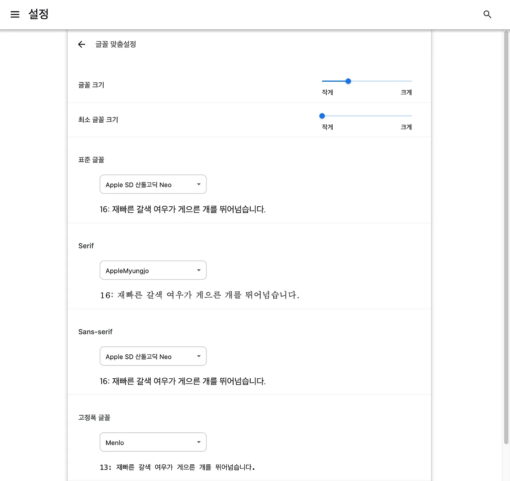

px 대신 rem을 사용하라는 얘기, 한 번쯤 들어보셨을 거예요.

> **_근데 왜일까요?_**

저는 개발하면서 늘 “왜?”라는 질문을 중요하게 생각해요... 그래서 이번 글에서는 **왜 rem이 권장되는지**, 그리고 그것이 **웹 접근성에 어떤 영향을 주는지** 이야기해보려 해요.

## 1. px, em, rem

우선 폰트크기를 지정할 때 쓰이는 단위들에 대해서 정리해봤어요.

- **px(pixel)**: 픽셀은 화면의 가장 기본적인 단위로, 고정된 크기를 가지고 있어요. 즉, 항상 같은 크기를 나타내고 다른 요소에 영향을 받지 않아요.
- **em**: em은 현재 요소의 폰트 크기를 기준으로 **상대적인 크기**를 정의하는 단위예요. 부모 요소의 글꼴 크기를 따라 상대적으로 정해지게 돼요. (부모요소의 글꼴 -> 16px / 자식요소의 글꼴 -> 1em 이면 자식요소의 글꼴은 16px)
- **rem(root em)**: em과 마찬가지로 **상대적인 크기** 단위예요. rem은 HTML 최상단 root요소의 글꼴 크기로부터 영향을 받아 em에 비해서 일관적인 글꼴 크기를 유지할 수 있어요.

> **_그래서 왜 rem? 이게 웹 접근성과 무슨 상관인데?_**

px은 고정된 크기를 가지고 있어요. 즉, 사용자가 마음대로 바꿀 수 없어요.

폰트 크기에 대한 우선순위는 **사용자의 설정 > 개발자의 CSS 설정**이에요.

## 2. 직접 느끼는 px과 rem의 차이


_크롬의 글꼴 맞춤 설정_

크롬은 브라우저의 폰트 크기를 사용자가 설정할 수 있도록 지원하고 있어요.

그렇다면 px과 rem의 차이를 예시를 통해 살펴보도록 해요.

```css
.header_title {
  font-size: 2.4rem;
}
```


_rem 사용 시_

좌측상단 타이틀이 글꼴 크기에 맞게 잘 늘어나고 줄어드는 모습을 볼 수 있어요.

```css
.header_title {
  font-size: 24px;
}
```


_px 사용 시_

px로 고정된 좌측 상단의 타이틀은 사용자가 글꼴을 아무리 설정해도 크기는 변하지 않는 모습을 볼 수 있어요.

결과적으로 우리는 웹 접근성 향상을 위해 rem 사용을 권장해야 해요.
폰트를 크게 보고 싶은 사용자가 px로 고정되어 있는 사이트를 본다면 더 이상 해당 웹에 머물고 싶지 않을 거예요.

> _유저는 언제나 개발자 위에 있어야 해요..._

## 3. 62.5%

하지만 px로 된 디자인을 보고 퍼블리싱을 해야 한다면,
px 값을 rem으로 환산하기 위해 위해 귀찮은 작업을 진행해야 해요.

```css
html {
  font-size: 62.5%;
}
```

root에 `font-size: 62.5%`을 지정해 주면 번거로운 계산 없이 페이지의 글꼴 크기가 10px로 적용돼요.

이제부터 우리 프로젝트에서의 1.6 rem은 16px이 되고, 2.4 rem은 24px이 돼요!
