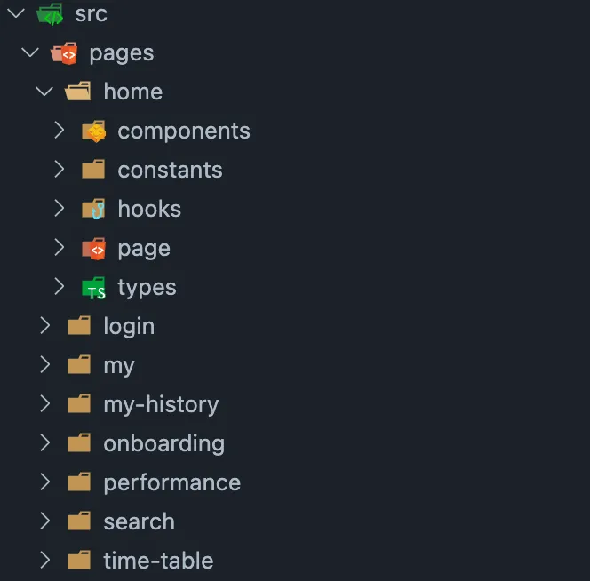

## 모노레포란 ?

모노레포(Mono-repo)는 하나의 저장소(레포지토리)에서 **여러 프로젝트**를 관리하는 방식을 의미해요.

멀티레포(Multi-repo)와 반대되는 개념으로 볼 수 있고, 각각의 장단점이 존재해요.

### 📚 멀티레포

> 멀티레포는 프로젝트마다 별도의 저장소가 필요하고, 각 프로젝트가 서로 독립적으로 동작하므로 관리에 용이하다는 장점이 있어요. 또한 빌드 시간이 짧고 배포가 빠르게 이루어지게 됩니다.
>
> 하지만 공통 코드(공통 컴포넌트)를 사용하는 경우 각 프로젝트에 코드를 복제해야하고, 이를 해결하기위해 design-system을 사용하려면 npm에 별도로 패키지를 배포해줘야 해요.
>
> 이 과정에서 프로젝트마다 CI/CD 파이프라인을 개별적으로 구축해줘야하기에 관리 비용이 증가하게 돼요.

## 🚀 confeti가 모노레포를 선택한 이유

### 1️⃣ 확장성

추가 스프린트를 진행하며 admin, 랜딩 페이지 등 프로젝트가 확장될 예정이었어요.

그러므로 단일 프로젝트보다는 **프로젝트 확장성을 염두**해둔 모노레포 혹은 멀티레포 세팅이 필요하다고 판단했어요.

### 2️⃣ 단일 조직

각 프로젝트별로 팀이 독립적으로 운영되고, 각각의 컨벤션을 갖는다면 멀티레포를 고려해볼만 했지만 confeti는 5인의 FE 개발자, 즉 **단일 조직이 여러 프로젝트를 관리**하기에 모노레포가 적합하다고 생각했어요.

또한 프로젝트 특성상 단기간 내에 성과를 내야하기에 멀티레포로 구성했을 때의 각 프로젝트에 대해서 Issue/PR을 따로 관리했을 때 발생하는 비용도 만만치 않을 것이라 판단했습니다.

### 3️⃣ Design System 관리

마지막으로는 **design-system 관리를 용이**하게 하기 위함이에요.

하나의 저장소에서 디자인 시스템 패키지를 관리함으로써 **일관성, 개발 속도, 유지 보수성**에서 장점을 얻고자 했어요.

모노레포를 사용하면 **별도의 배포 없이도 디자인 시스템 내부의 코드를 사용**할 수 있기에 해당 과정에서 발생하는 비용을 최소화 할 수 있다고 생각했어요.

## 🎯 모노레포 구성 방법

모노레포를 구성하는 방식은 크게 두가지로 나뉘어요.

1. 모노레포 빌드 시스템 도구 없이 **패키지 매니저로 구성**
2. 모노레포 **빌드 시스템 도구를 함께 사용**

### 1️⃣ 모노레포 빌드 시스템 도구 없이 패키지 매니저로 구성

npm, yarn, pnpm 모두 workspace를 통해 모노레포를 지원해요. workspace는 자체적인 종속성 트리를 구성하고, 완전히 분리된 프로젝트를 만들 수 있게 해요.

패키지 매니저만으로 모노레포를 구성하면 모노레포 빌드 시스템 도구를 사용하며 발생하는 **오버헤드를 줄일 수 있어요.**

하지만 규모가 커지며 발생하는 빌드 속도를 해결하기 위한 **병렬 빌드, 캐싱의 기능**을 지원하지 않기에 **성능 최적화에서는 단점**을 가져요.

### 2️⃣ 모노레포 빌드 시스템 도구를 함께 사용

규모가 커지거나 여러 애플리케이션이 서로 종속성을 가지는 경우, **모노레포 빌드 시스템 도구**를 패키지 매니저와 함께 사용하는 것이 필요해요.

대표적인 도구로는 **Turborepo, Nx** 등이 있으며, 각 도구는 빌드 속도, 의존성 그래프 분석, 캐시 등 다양한 기능을 제공해요.

이 방식은 **빌드 속도 최적화**와 **의존성 관계 분석**에서 강력한 장점을 가져요. 특히 프로젝트가 커질수록 **병렬 빌드, 부분 빌드, 캐시를 활용한 최적화**가 필요해지는데, 이를 모노레포 빌드 시스템이 해결해줘요.

## 📌 Turborepo + Pnpm을 선택한 이유

### 1️⃣ 빌드 속도 최적화

Turborepo는 **빌드 캐시**와 **병렬 처리** 기능을 제공해, 중복된 빌드를 피하고 빠르게 결과물을 생성해요. 예를 들어, 하나의 프로젝트를 빌드할 때 종속된 패키지가 이미 빌드되어 있다면 이를 재활용해 전체 빌드 시간을 단축시킬 수 있어요.

- **결과물 재사용**: 이미 빌드된 결과물이 있을 경우, 변경된 부분만 빌드
- **병렬 처리**: 여러 애플리케이션을 동시에 빌드해 전체적인 빌드 시간을 크게 단축

### 2️⃣ 다른 도구에 비해 낮은 러닝커브

Vercel팀에서 개발한 Turborepo는 **설정이 간단하고 러닝 커브가 낮아** 빠르게 도입할 수 있어요. 또한 Vercel과의 연동이 원활하고, Next.js 프로젝트와의 호환성이 뛰어나다는 장점이 있어요.

### 3️⃣ Pnpm 선택 이유

**npm**은 의존성 설치 속도가 상대적으로 느리고, **Yarn Classic**은 nohoist 이슈로 인해 모노레포에서 패키지 매니저는 선택사항에서 제외했어요.

_https://classic.yarnpkg.com/blog/2018/02/15/nohoist/_

**Yarn Berry**는 PnP 방식으로 node_modules 구조가 사라지기 때문에 초기에 학습 비용이 발생할 수 있고, npm, yarn에 익숙한 팀원들이 적응하는데 오래 걸릴 것이라 판단했어요.

반면에 **Pnpm(Performent npm)**은 npm/yarn 사용자에게 친숙한 환경을 제공하고, 하드링크 및 심볼릭 링크를 통하여 패키지를 설치하므로 의존성 설치 속도와 디스크 사용량 절감에서도 큰 장점을 가져요.

추가적으로 Turborepo에서도 Pnpm 사용을 권장하고 있어요 !

## 👀 Confeti 모노레포 구조 알아보기

_confeti 프로젝트 구조_

### `apps/`

- 실제 배포 및 운영되는 애플리케이션이 위치
- React로 구성된 confeti client가 해당 부분에 위치
- 애플리케이션 별로 독립적인 package.json이 존재할 수 있음

### `packages/`

- **재사용 가능한 라이브러리** 및 **공통 모듈**이 위치
- Design System이 해당 부분에 위치
- 한 번 빌드된 결과물이 캐시로 재사용(Turborepo)

### `config/`

- 프로젝트에서 사용하는 공통 설정 파일이 위치
- ESLint 및 TypeScript 설정이 포함되어 있으며, 각 애플리케이션이 해당 설정을 공유

_config 폴더_

### `pnpm-workspace.yaml`

- **Pnpm 워크스페이스**에서 어떤 폴더를 패키지로 인식할지를 설정
- `apps/`, `packages/`,`config/` 폴더 아래의 모든 프로젝트를 워크스페이스로 등록

_pnpm-workspace_

### `turbo/`

- Turborepo 캐시 및 설정 파일이 저장됨 (.gitignore에 포함)

_.turbo 폴더_

### `turbo.json`

- **Turborepo의 구성 파일**로, 모노레포(Monorepo) 환경에서 **빌드, 테스트, 린트, 개발 서버 실행 등** 다양한 작업(task)의 실행 방식과 의존성을 정의함

_turbo.json_

---

또한 apps/client 내부 리액트 프로젝트에서는 크게 pages와 shared로 구분돼요.

_apps/client/src_

_apps/client/src/pages_

_apps/cleint/src/shared_

페이지(도메인)기반 구성과 공통 모듈을 명확하게 분리하고자 했고,

이는 다음과 같은 장점을 가져요.

### 페이지 단위 분리 (도메인 기반 아키텍처)

- `src/pages/home`, `my`, `search`, `time-table` 각각의 폴더가 독립된 페이지(도메인)를 나타냄.
- 각 도메인 폴더 안에 `components`, `hooks`, `constants`, `types`, `page` 등을 별도로 구분해 **응집도 높고 재사용 가능한 구조**로 개발 가능.
- **도메인 단위로 코드 관리**가 쉬워지고, 유지보수성과 협업 효율이 증가함.

### 공통된 코드의 일관된 관리 (shared)

- `shared` 폴더 안에 프로젝트 전반에서 사용하는 코드들이 위치
  - `shared/hooks`, `shared/constants`, `shared/utils`: 중복 없는 코드 작성을 유도
  - `shared/apis`: API 요청 모듈을 통합하여 **API 호출의 일관성 유지**
  - `shared/router`: 라우팅 관련 설정을 한곳에 모아 관리 편리

### 확장성과 유지보수성

- 새로운 페이지가 추가될 경우 `pages/새페이지` 디렉토리 하나만 만들면 됨.
- 도메인별로 관심사를 구분해 놓았기 때문에 **코드가 늘어나도 복잡도가 폭증하지 않음**.
- 유지보수 시 영향을 주는 범위가 명확하게 드러남 (ex. `home` 수정은 `pages/home` 내에서 해결됨)
