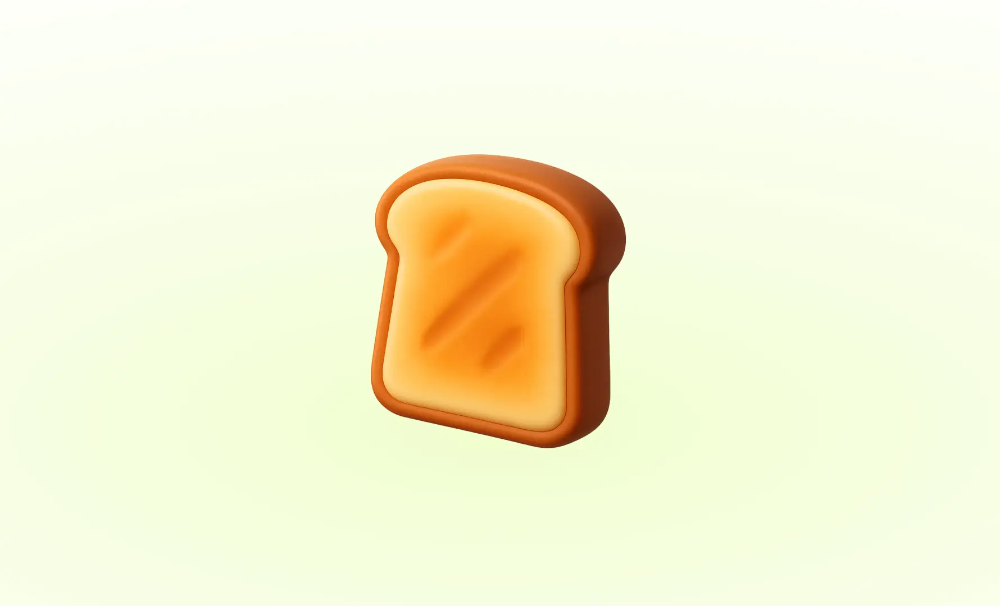

{/*  */}

> **React Compact Toast**는 React 애플리케이션에서 간편하고 경량화된 토스트 알림을 제공하기 위해 설계한 오픈소스 UI 라이브러리예요.  
> 이번 포스트에서는 React Compact Toast의 개발과정과 내부 구조에 대해 작성했어요. <br/><br/>
> [**GitHub**](https://github.com/m2na7/react-compact-toast) | [**Site**](https://react-compact-toast.vercel.app/) | [**npm**](https://www.npmjs.com/package/react-compact-toast)

[**오픈소스 제작기는 2편을 참고해주세요.**](http://m2na.dev/posts/react-compact-toast-part2)

## 1. 왜 직접 제작했는가?

기존 외부 라이브러리들은 불필요한 기능들이 많아 번들 크기가 크고, 기본 UI를 커스텀하기 어려웠어요.  
디자인 요구사항에 맞춰 커스텀하려면 직접 ToastContainer의 CSS를 가지고와 하나하나 수정을 해줘야하는 방식이 대부분이었죠.

**그래서 한 번 직접 개발해보자고 결심하게 되었어요.**

핵심 목표는 다른 라이브러리와 마찬가지로 useToast훅이나 Context API 없이도 `toast()` 코드 한 줄로 어디서든 원하는 메시지를 띄우는 것이었어요.

```typescript
import { useToast } from './hooks'

const { showToast } = useToast() // useToast 훅 필요

const handleClick = () => {
  showToast('성공!')
}
```

```typescript
import { toast } from 'react-compact-toast'

const handleClick = () => {
  toast('성공!') // 어디서든 바로 호출 가능
}
```

이 방식을 가능하게 하려면 **React 컴포넌트 트리와 완전히 분리된** 통신 시스템이 필요했어요.

## 2. 이벤트 기반 토스트 시스템

그래서 선택한 것이 이벤트 기반(EventManager) 구조였어요.

앞서 언급했던

> **Context API나 useToast 훅 없이도 어디서든 한 줄로 호출 가능한 API**

해당 목표를 달성하기 위해 Publisher–Subscriber(발행–구독) 패턴을 도입했어요.

`ToastContainer`는 `eventManager`가 발행하는 이벤트를 구독하고, `toast()`는 어디서든 동일한 `eventManager`를 통해 이벤트를 발행해요.  
이렇게 하면 컴포넌트 트리와 완전히 분리된 통신이 가능하고, 앱 어디서든 동일한 API로 토스트를 띄울 수 있게 돼요.

### Structure

```ts
src/
├── components/
│   ├── toast.tsx              # 개별 토스트 컴포넌트
│   ├── toast-container.tsx    # 토스트 컨테이너
├── hooks/
│   └── use-toast.ts            # 토스트 훅
│   └── use-toast-container.ts  # 토스트 컨테이너 훅
├── core/
│   └── event-manager.ts        # 이벤트 관리자
│   └── toast.ts                # 토스트 함수
```

### LifeCycle

```ts
1. 사용자 호출              2. 이벤트 발행             3. 컨테이너 구독
   toast('Hello!')    →    eventManager.emit()   →   addToast() 실행

4. 상태 업데이트           5. 렌더링                   6. 자동 타이머
   setToastList()     →    <Toast /> 생성         →    setTimeout()

7. 애니메이션             8. 삭제 이벤트                9. 정리 완료
   CSS animation      →    eventManager.emit()   →    DOM에서 제거
```

## 3. 토스트 구현 과정

### 1) EventManager 설계

먼저 이벤트 기반 토스트 시스템의 핵심인 EventManager에 대해서 살펴볼게요.  
`eventManager`는 모든 통신의 중심이 되는 시스템으로, **구독/발행(Publisher-Subscriber) 패턴**으로 동작해요.

```typescript
// event-manager.ts

export const eventManager: EventManager = {
  list: new Map(), // 이벤트별 콜백 목록
  emitQueue: new Map(), // 타이머 관리용 큐
  activeToastCount: 0, // 화면에 표시된 토스트 개수

  on(event, callback) {
    /* ... */
  }, // 구독
  emit(event, ...args) {
    /* ... */
  }, // 발행
  off(event, callback) {
    /* ... */
  }, // 구독 취소
  cancelEmit(event) {
    /* ... */
  }, // 예약된 발행 취소
}
```

- **on()**: 이벤트 구독 등록
- **emit()**: 이벤트 발행 및 콜백 실행
- **off()**: 구독 해제 (메모리 누수 방지)
- **cancelEmit()**: 예약된 타이머 정리

> 이제 각각의 이벤트들을 어떻게 구현했는지, 그리고 구현 과정에 대해 자세히 알아볼게요.

#### emit 이벤트

```typescript
emit(event, ...args) {
  const callbacks = this.list.get(event)!
  callbacks.forEach((callback) => {
    callback(...args); // 바로 실행
  });
}
```

처음에는 위와 같이 가장 직관적인 방식으로 `emit`을 구현했어요.  
이벤트가 발생하면 즉시 등록된 콜백들을 실행하는 방식이었죠.

하지만 이 방식에는 큰 문제가 있었어요.  
**React는 컴포넌트를 렌더링하는 중에 다른 컴포넌트의 상태를 변경하는 것을 허용하지 않거든요.**

예를 들어, 컴포넌트 A가 렌더링 중에 `toast('메시지')`를 호출하면

1. `eventManager.emit()`이 바로 실행
2. `addToast()` 콜백이 즉시 실행
3. ToastContainer의 상태가 변경
4. React가 "렌더링 중에 다른 컴포넌트 상태 변경" 경고 발생

```terminal
Warning: Cannot update a component while rendering a different component
```

그래서 이벤트 실행을 `setTimeout()`을 이용해 **다음 이벤트 루프로 지연**시키는 방식을 도입했어요.

```typescript
emit(event, ...args) {
  const callbacks = this.list.get(event)!

  callbacks.forEach((callback) => {
    const timer = setTimeout(() => {
      switch (event) {
        case ToastEvent.Add:
          this.activeToastCount += 1
          callback(...args)
          break
        case ToastEvent.Delete:
          this.activeToastCount -= 1
          callback(...args)
          break
      }
    }, 0) // 다음 이벤트 루프에서 실행

    // 타이머 추적 (메모리 누수 방지용)
    this.emitQueue.set(event, [...(this.emitQueue.get(event) || []), timer])
  })
}
```

이렇게 하면 **React 렌더링과 완전히 분리**돼서 언제든 안전하게 토스트를 호출할 수 있어요.  
동작 원리는 다음과 같아요.

```terminal
[현재 실행 스택]
1. toast('hello!') 호출
2. eventManager.emit() 실행
3. setTimeout 예약만 하고 바로 return

--- 이벤트 루프 ---

[다음 실행 스택]
1. setTimeout 콜백 실행
2. addToast() 호출
3. React 상태 업데이트
```

#### 메모리 관리 (off & cancelEmit)

<br />

구독하고 등록만 한다고 당연히 끝이 아니겠죠?  
이벤트 구독과 발행만으로는 완전한 시스템이 아니에요. **메모리 누수를 방지하는 정리 작업**이 필수예요.

> **왜 정리 작업이 필요할까요?**

`eventManager`는 React 컴포넌트와 독립적으로 동작하는 전역 객체이기 때문에,
컴포넌트가 언마운트되더라도 `eventManager`는 계속 살아 있어요.  
따라서 구독을 해제하지 않으면 다음과 같은 문제가 생길 수 있어요.

1. **구독 콜백 누수**: 이미 사라진 컴포넌트의 콜백이 여전히 등록되어 있어서 호출 시 에러 발생
2. **타이머 누수**: `setTimeout()`으로 예약된 작업들이 계속 실행되어 불필요한 메모리 사용

예를 들어, `ToastContainer`가 있는 페이지에서 다른 페이지로 이동했을 때, 다음과 같은 상황이 발생할 수 있어요.

```ts
1. ToastContainer 마운트 → eventManager.on() 구독
2. 사용자가 다른 페이지로 이동 → ToastContainer 언마운트
3. 하지만 eventManager에는 여전히 콜백이 등록되어 있음
4. toast() 호출 시 → 존재하지 않는 컴포넌트의 콜백 실행 → 에러!
```

**off() 함수로 구독 해제**

```ts
off(event, callback) {
  if (callback && this.list.has(event)) {
    // 특정 콜백만 제거
    const callbacks = this.list.get(event)!;
    const filteredCallbacks = callbacks.filter((cb) => cb !== callback);
    this.list.set(event, filteredCallbacks);
  } else if (!callback) {
    // 콜백을 지정하지 않으면 해당 이벤트의 모든 구독자 제거
    this.list.delete(event);
  }
  return this;
}
```

**cancelEmit() 함수로 예약된 타이머 정리**

앞서 `emit()` 함수에서 `setTimeout()`으로 예약한 작업들도 정리해야 해요.

```ts
cancelEmit(event) {
  if (this.emitQueue.has(event)) {
    const timers = this.emitQueue.get(event)!; // 해당 이벤트의 모든 타이머들
    timers.forEach(clearTimeout); // 각 타이머 취소
    this.emitQueue.delete(event); // 큐에서 제거
  }
  return this;
}
```

<br />

### 2) 컨테이너 구독 준비

이제 `eventManager`가 준비되었으니, 이 이벤트들을 **누가 받을지** 정해야 해요. `ToastContainer`가 그 역할을 담당해요.

앱이 시작되면 `ToastContainer`가 마운트되면서 `eventManager`의 이벤트들을 구독해요.

```ts
// use-toast-container.ts

useEffect(() => {
  // 이벤트 구독 등록
  eventManager.on(ToastEvent.Add, addToast) // 새 토스트 생성 시 호출
  eventManager.on(ToastEvent.Delete, deleteToast) // 토스트 삭제 시 호출

  return () => {
    // 컴포넌트 언마운트 시 구독 해제 (메모리 누수 방지)
    // 이 단계가 없으면 컴포넌트가 제거된 후에도 콜백이 남아있어 메모리 누수가 발생해요
    eventManager.off(ToastEvent.Add, addToast)
    eventManager.off(ToastEvent.Delete, deleteToast)

    // 대기 중인 타이머들도 모두 취소
    // emit() 함수에서 setTimeout으로 생성된 타이머들을 정리해요
    eventManager.cancelEmit(ToastEvent.Add)
    eventManager.cancelEmit(ToastEvent.Delete)
  }
}, [addToast, deleteToast])
```

여기서 등록된 콜백 함수들이 나중에 `eventManager.emit()`이 호출될 때 실행돼요.  
React의 의존성 배열에 콜백들을 넣어서 참조가 변경되면 구독을 다시 설정해요.

이렇게 **구독 → 사용 → 정리**의 완전한 생명주기를 관리해서 메모리 누수 없는 안전한 이벤트 시스템을 만들었어요.

<br />
### 3) 토스트 생성 요청

이제 사용자가 실제로 사용하게 될 API를 살펴볼게요.  
사용자가 어디서든 `toast()`를 호출하면 `eventManager.emit()`이 호출되고, 즉시 이벤트가 발행돼요.  
이 단계에서 **아직 React 컴포넌트는 전혀 관여하지 않아요.**

```ts
// toast.ts

export const toast = (options: ToastOptions | string): string => {
  const toastOptions: ToastOptions =
    typeof options === 'string' ? { text: options } : options

  // 고유 ID 생성
  const id = crypto.randomUUID()

  // 이벤트 발행 - 여기서 1단계에서 만든 EventManager 사용!
  eventManager.emit(ToastEvent.Add, {
    ...toastOptions,
    toastId: id,
  })

  return id
}
```

<br />
### 4) 컨테이너의 상태 업데이트

`eventManager`의 `setTimeout(0)` 타이머가 만료되면서 등록된 콜백 함수들이
실행돼요.  
그리고 여기서 **React 상태 업데이트**가 발생해요.

```ts
// use-toast-container.ts

// 토스트 추가 콜백 - eventManager.on()으로 등록된 함수
const addToast = useCallback((props: ToastProps) => {
  setToastList((prev) => {
    const newMap = new Map(prev)
    newMap.set(props.toastId, props) // 새 토스트를 Map에 추가
    return newMap
  })
}, [])

// 토스트 삭제 콜백
const deleteToast = useCallback((id: string) => {
  setToastList((prev) => {
    if (!prev.has(id)) return prev

    const newMap = new Map(prev)
    newMap.delete(id) // 해당 ID의 토스트 제거
    return newMap
  })
}, [])
```

<br />

### 5) 개별 토스트의 생명주기 관리

각 토스트 컴포넌트가 마운트되면서 **독립적인 생명주기**를 시작해요.  
여기서 시간이 지나면 토스트 컴포넌트가 자동으로 사라지는 기능과 애니메이션을
관리해요.

```typescript
// use-toast.ts

export const useToast = (
  toastId: string,
  autoClose?: number | false,
  closeOnClick = true
) => {
  const [isExiting, setIsExiting] = useState(false)

  // autoClose 타이머 설정
  useEffect(() => {
    if (autoClose) {
      const timer = setTimeout(() => {
        setIsExiting(true)
      }, autoClose)

      // 컴포넌트 언마운트 또는 autoClose 변경 시 타이머 정리
      return () => clearTimeout(timer)
    }
  }, [autoClose])

  // CSS 애니메이션 완료 시 호출
  const handleAnimationEnd = () => {
    if (isExiting) {
      // 애니메이션이 완료된 후에만 실제 삭제 이벤트 발행
      eventManager.emit(ToastEvent.Delete, toastId)
    }
  }

  // 사용자 클릭 시 호출
  const handleClick = () => {
    if (closeOnClick) {
      setIsExiting(true)
    }
  }

  return {
    isExiting,
    handleAnimationEnd,
    handleClick,
  }
}
```

1. **애니메이션 시작**: `isExiting: true` → CSS 애니메이션 트리거
2. **실제 제거**: 애니메이션 완료 → `eventManager.emit(Delete)` → DOM 제거

이런 방식으로 분리한 이유는 **UX를 개선**하기 위해서예요.  
사용자가 토스트를 닫을 때(`handleClick` 함수) 갑자기 사라지는 것보다 부드럽게 페이드아웃되는 편이 더 자연스럽기 때문이에요.

토스트가 사라지는 과정을 정리해보면 다음과 같아요.

> 1. **타이머 만료** 또는 **사용자 클릭**으로 `isExiting: true` 설정 <br />
> 2. **CSS 애니메이션** 실행 <br />
> 3. **애니메이션 완료** 후 `handleAnimationEnd()` 호출 <br />
> 4. **삭제 이벤트 발행**: `eventManager.emit(ToastEvent.Delete, toastId)` <br />
> 5. **컨테이너에서 제거**: `deleteToast(id)` 실행으로 상태에서 제거 <br />
> 6. **DOM에서 제거**: React가 해당 토스트 컴포넌트 언마운트 <br />

이렇게 **구독 → 발행 → 렌더링 → 타이머 → 애니메이션 → 해체**의 완전한 생명주기가 <br />
EventManager를 중심으로 안전하게 관리돼요.

---

이제 최종 목표인 `toast()` 한 줄로 토스트를 띄울 수 있게 됐어요!

```typescript
import { toast } from 'react-compact-toast'

const handleClick = () => {
  toast('성공!')
}
```
자세한 소스코드는 [**깃허브 저장소**](https://github.com/m2na7/react-compact-toast)에 공개되어 있어요.


> [**2편 - 오픈소스 제작기 보러가기 →**](http://m2na.dev/posts/react-compact-toast-part2)

