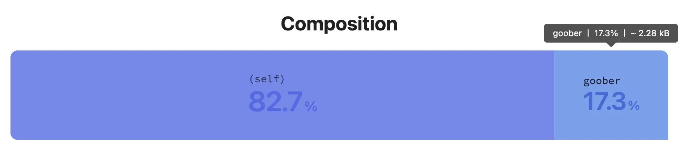
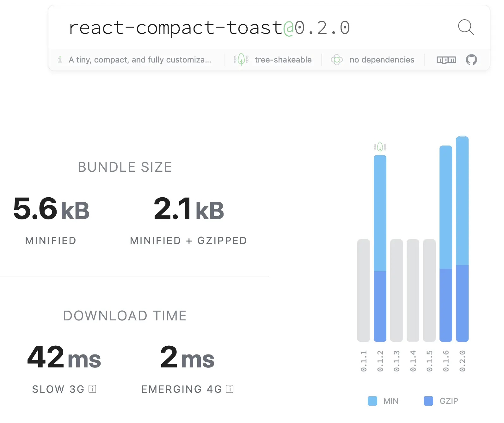

> **React Compact Toast**는 React 애플리케이션에서 간편하고 경량화된 토스트 알림을 제공하기 위해 설계한 오픈소스 UI 라이브러리예요.  
> 이번 포스트에서는 직접 만든 토스트 컴포넌트를 실제 오픈소스 라이브러리로 만들어가는 과정에 대해 작성했어요. <br/><br/>
> [**GitHub**](https://github.com/m2na7/react-compact-toast) | [**Site**](https://react-compact-toast.vercel.app/) | [**npm**](https://www.npmjs.com/package/react-compact-toast)

[**토스트 컴포넌트 구현 이야기는 1편을 참고해주세요.**](http://m2na.dev/posts/react-compact-toast-part1)

## 1. 오픈소스 라이브러리로 만들어보자

직접 토스트 컴포넌트를 구현한 후, 이번에는 이를 **오픈소스 라이브러리로 배포해보자**는 목표가 생겼어요.
처음에는 단순히 폴더를 분리하고 저장소에 올리면 끝일 거라 생각했지만 실제로는 번들링, npm 배포 등 해야 할 일이 많았어요.

이미 많은 토스트 라이브러리가 존재하기 때문에, 다른 사람들이 제 라이브러리를 선택하려면 차별화된 장점이 필요했어요.  
저는 그중에서도 처음 라이브러리를 도입할 때 가장 고민됐던 **번들 크기 문제**를 줄이는 데 집중했으며,
안정적으로 운영될 수 있도록 꼼꼼하게 **테스트 코드도 작성했어요.**

## 2. 테스트 코드 작성

많은 사용자들이 신뢰할 수 있는 라이브러리가 되기 위해서는 테스트 코드가 필수예요.
이를 위해 두 가지의 테스트 도구를 도입했어요.

### Vitest

핵심 로직을 검증하기 위해 단위 테스트를 작성했어요.

- EventManager의 pub/sub 동작
- 토스트 생명주기 관리
- 타이머 정리 및 메모리 누수 방지

### Cypress

실제 브라우저 환경에서 컴포넌트를 테스트하기 위해 사용했어요.

- 토스트 애니메이션 동작
- 위치별 렌더링 확인
- 사용자 상호작용 시나리오

> **Cypress로 컴포넌트 테스트를??**

**Cypress**는 원래 E2E(End-to-End) 테스트로 많이 알려져있지만,
단일 컴포넌트를 실제 브라우저에서 렌더링해 동작을 검증하는 **Component Testing**도 지원해요.

물론 **React Testing Library**를 사용해 컴포넌트 테스트를 작성할 수도 있지만,
이 경우 테스트가 JSDOM(가짜 DOM)에서 실행되기 때문에 브라우저 환경과 100% 동일하지 않을 수 있어요.

토스트 컴포넌트처럼 애니메이션·레이아웃·위치가 중요한 UI는 실제 브라우저 렌더링과 동작을 확인할 수 있는
**Cypress Component Testing**이 더 적합하다고 생각했어요.

<video width="100%" controls>
  <source src="./assets/cypress.mp4" type="video/mp4" />
  Cypress 테스트 실행 화면
</video>

<br />

영상을 보면 실제 브라우저에서 토스트가 렌더링되고 애니메이션이 적용되는 과정을 직접 확인할 수 있어요.  
Cypress가 제공하는 DOM Snapshot 기능을 통해 특정 테스트가 실행될 때의 DOM 상태를 시각적으로 확인하고 디버깅할 수도 있어요.

## 3. 번들링 도구 선택

처음에는 번들링 도구로 **esbuild**를 사용했어요.  
Go 언어로 작성돼 빌드 속도가 매우 빠르고, 사용자층이 넓어 참고할 자료도 많았기 때문이에요.
Webpack이나 Rollup보다 설정은 훨씬 간단했지만,
라이브러리 배포용으로 쓰기 위해 설정해야 할 항목이 필요 이상으로 많다고 생각했어요.

- **CSS 처리가 복잡하고, 별도 플러그인이 필요함**
- **TypeScript 선언 파일(d.ts) 생성을 위해 tsc를 별도로 실행해야 함**
- **멀티 포맷(CommonJS + ESM) 빌드 설정이 번거로움**

그래서 **tsup**으로 전환하게 되었어요.

tsup은 내부적으로 esbuild를 사용하지만, 라이브러리 개발에 특화된 기능을 기본으로 제공해요.  
예를 들어, TypeScript 선언 파일 생성, CSS 번들링, CommonJS+ESM 동시 빌드 같은 작업을
별도의 파일 생성 없이 `tsup.config.ts` 파일 하나로 한 번에 처리할 수 있어 훨씬 편리했어요.

```javascript
// tsup.config.ts

import { defineConfig } from 'tsup'

export default defineConfig([
  // 메인 번들
  {
    entry: ['src/index.ts'],
    format: ['cjs', 'esm'], // CommonJS와 ESM 포맷 출력
    dts: true, // TypeScript 선언 파일 생성
    external: ['react', 'react-dom'],
    injectStyle: true, // CSS를 JS에 인라인으로 삽입
    minify: true, // 코드 압축
    treeshake: true, // 사용되지 않는 코드 제거
    outDir: 'dist',
  },
  // CSS 번들
  {
    entry: ['src/styles.css'],
    outDir: 'dist',
  },
])
```

## 4. 번들 크기 최적화

이제 해결해야 하는 중요한 문제는 **번들 크기 최적화**예요.  
기존에 가장 많은 유저가 사용하는 토스트 라이브러리의 번들 크기(Bundlephbia, gzipped 기준)는 다음과 같았어요.

- **sonner**: 9.3KB
- **react-toastify**: 6.9KB
- **react-hot-toast**: 5.2KB

저는 이 라이브러리보다 최소 2배는 가벼운 라이브러리를 목표로 삼았어요.

### 1) Tree-shaking 친화적으로 만들기

Tree-shaking은 번들 크기 최적화에서 핵심적인 개념이에요.
간단히 설명하자면, 사용되지 않는 코드를 자동으로 제거해주는 기술이에요.  
말 그대로 나무를 흔들어 나무 속의 작은 잎들을 제거하는 것처럼, 사용되지 않는 코드를 제거해주는 거죠.

```typescript
import { toast } from 'react-compact-toast'
// eventManager는 사용하지 않았음
```

위에 예시 코드에서 Tree-shaking이 제대로 동작한다면 `eventManager` 관련 코드는 최종 번들에서 빠져야 해요.
하지만 export 방식을 잘못하면 안 쓰는 코드도 모두 포함되어 번들 크기가 커져요.

**Default export**

```typescript
// 라이브러리 내부에서 default로 export하면
export default {
  toast,
  ToastContainer,
  useToast,
  eventManager,
}

// 사용자가 toast만 import해도 모든 코드가 번들에 포함돼요.
import { toast } from 'react-compact-toast'
```

Default export 방식은 객체 하나로 모든 것을 묶어 내보내기 때문에,
번들러 입장에서는 객체 전체가 필요하다고 판단해요.
따라서 실제로 `toast`만 써도 `ToastContainer`, `useToast`, `eventManager`까지 모두 번들에 포함돼요.

**Named export**

```typescript
// 라이브러리 내부에서 named로 export하면
export { toast } from './core/toast'
export { ToastContainer } from './components/toast-container'
export { useToast } from './hooks/use-toast'
export { eventManager } from './core/event-manager'

// 사용자가 필요한 것만 import할 수 있어요.
import { toast } from 'react-compact-toast'
```

Named export 구조 덕분에 사용자는 정말 필요한 코드만 선택적으로 import할 수 있어요.  
하지만, Named export만 있다고 해서 tree-shaking이 자동으로 되는 것은 아니에요.

> **tsup을 사용한다면?**

tsup은 기본적으로 사용되지 않는 코드(ex. `eventManager`)를 최종 번들에서 제거해요. (Tree-shaking 기본 적용)

즉, **Named export + tsup**을 함께 쓰면,
사용자가 `toast`만 import했을 때 최종 번들에는 `toast` 관련 코드만 포함되고 나머지는 제거돼요.

이 구조 덕분에 우리 라이브러리는 필요한 부분만 가져다 쓸 수 있는 모듈화된 구조가 되었어요.

### 2) 불필요한 의존성 제거

webpack-bundle-analyzer를 사용해 번들 크기를 확인해보니,
기존에 사용하던 Vanilla Extract CSS 라이브러리가 상당 부분을 차지하고 있는 것을 확인할 수 있었어요.

번들 크기를 최적화하기 위해, **라이브러리 내부 스타일을 기본 CSS로 직접 구현하도록 수정했어요.**

참고로, 다른 토스트 라이브러리인 react-hot-toast에서는 goober라는 CSS-in-JS 라이브러리를 사용하고 있는데,
**최종 번들 크기에서 약 17%를 차지**하는 것을 확인할 수 있어요.



<br />

이러한 노력을 통해 최종적으로 **약 2.1KB까지 번들 크기를 최적화할 수 있었어요.**



> **처음 목표였던 2배 보다 더 가벼운 번들 크기를 달성했어요!**

최종적으로 비교를 해보면 다음과 같아요.

<table
  style={{
    width: '100%',
    textAlign: 'center',
    borderCollapse: 'separate',
    borderSpacing: '20px',
  }}
>
  <thead>
    <tr>
      <th>라이브러리</th>
      <th>번들 크기 (gzipped)</th>
    </tr>
  </thead>
  <tbody>
    <tr>
      <td>sonner</td>
      <td>9.3KB</td>
    </tr>
    <tr>
      <td>react-toastify</td>
      <td>6.9KB</td>
    </tr>
    <tr>
      <td>react-hot-toast</td>
      <td>5.2KB</td>
    </tr>
    <tr>
      <td>
        <strong>react-compact-toast</strong>
      </td>
      <td>
        <strong>2.1KB</strong>
      </td>
    </tr>
  </tbody>
</table>

## 5. CI/CD와 자동화

이제 마지막 단계인 배포 자동화가 필요해요.  
매번 수동으로 `npm publish`를 진행하는 것은 번거롭고, 실수가 발생할 가능성도 있었기 때문에
**GitHub Actions를 활용해 자동화를 설정했어요.**

총 두 가지 워크플로우를 구성했으며, 관련 yaml코드는 [여기서 확인](https://github.com/m2na7/react-compact-toast/tree/main/.github/workflows)할 수 있어요.

### 테스트 및 커버리지 자동화

- PR이나 main/develop 브랜치로 푸시될 때마다 자동으로 실행
- Cypress를 이용한 컴포넌트 테스트와 Vitest 단위 테스트를 모두 수행
- 테스트 결과와 코드 커버리지를 Codecov에 업로드

이렇게 하면 코드 품질과 테스트 커버리지를 항상 확인할 수 있어, 배포 전 문제를 사전에 발견할 수 있어요.

### 배포 자동화

정식 버전 태그를 푸시하면 GitHub Actions가 **자동으로 npm에 배포**하도록 설정했어요.


## 6. 돌이켜보니

처음에는 단순히 “내가 쓸 컴포넌트 하나 만들어볼까?”라는 생각으로 시작했지만,  
어쩌다 보니 **번들 최적화, 테스트 자동화, CI/CD 구축**까지 직접 경험하게 되었어요.

그만큼 보람도 컸어요.  
실제로 다른 개발자가 라이브러리를 사용하며 피드백을 줬던 매우 감사한 일이 생겼어요...  

한 예로, Toast 위치를 커스텀하지 못하는 문제가 제보되었을 때는 offset 옵션을 활용해 빠르게 수정했던 경험이 기억에 남아요.  
이 과정을 통해 내가 만든 것이 실제로 도움이 된다는 뿌듯함과 함께, 사용자 피드백의 중요성을 다시 한 번 느낄 수 있었어요.

**시작은 단순했지만, 예상보다 훨씬 많은 것을 배우고 경험할 수 있었어요.**

---


버그 제보, 기능 요청, 기여 모두 환영해요.

> **React Compact Toast**
> 
> [⭐️ GitHub](https://github.com/m2na7/react-compact-toast)
