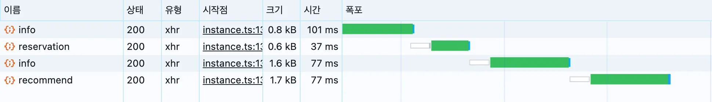
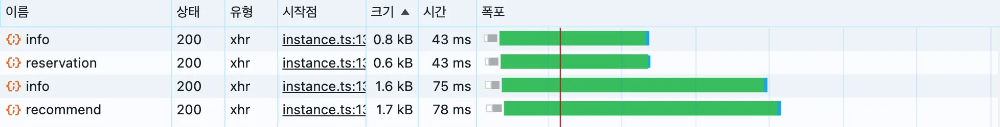

# useSuspenseQueries로 request waterfall 현상 해결하기

request waterfall 현상을 해결하며, 홈 페이지 진입속도를 약 73% 단축시킨 경험을 적었어요.

> TanStack Query와 React Suspense를 함께 사용할 때,
>
> 의도치 않게 **request waterfall 현상**이 발생해 느린 사용자 경험을 겪은 적 있으신가요?

confeti 프로젝트 내에서 `useSuspenseQuery`를 활용하던 중 이러한 문제를 마주하게 되었고,

이를 `useSuspenseQueries` 패턴으로 개선하면서 문제를 해결해봤어요.

이 글에서는 request waterfall 현상이 무엇인지, 왜 발생했는지, 그리고 어떻게 해결했는지 상세히 정리해보려고해요.

## 🌀 Request Waterfall이란?

**request Waterfall**은 여러 개의 API 요청이 **병렬로 실행되지 않고 순차적으로 실행되는** 상황을 말해요.

즉, 하나의 네트워크 요청이 완료된 이후에만 다음 요청이 시작되는 구조예요.

이런 구조는 특히네트워크가 지연되는 상황에서 굉장히 치명적이에요.

> 요청 1개당 250ms가 걸린다고 가정하면,4개의 연속 요청은 총 **1초**가 소요돼요.
>
> 반면에 **병렬 요청이라면 250ms만에** 모든 데이터를 받아올 수 있었을 거예요.

결과적으로 불필요한 대기 시간이 누적되면서,사용자에게는 **느리고 답답한 화면**으로 느껴질 수밖에 없어요.

## ❗️ Suspense와 useSuspenseQuery가 만났을 때 생기는 문제

TanStack Query의 `useSuspenseQuery`는 Suspense를 활용하여 `isLoading` 없이 로딩 처리를 가능하게 해줘요.

하지만 이 기능은 다음과 같은 특징을 가지고 있어요.

- `queryFn`이 실행되면, TanStack Query는 내부적으로 **Promise를 throw**해서 `Suspense fallback`으로 제어를 넘김
- React는 첫 번째로 throw된 Promise를 처리하고 나서야, 해당 컴포넌트를 다시 렌더링함
- 이때 **React는 중단된 렌더링을 다시 시작하면서 그때까지 도달하지 못했던 다른** `useSuspenseQuery`**들을 순차적으로 실행**하게 됨

즉, 여러 개의 `useSuspenseQuery`를 하나의 컴포넌트에서 나란히 호출했더라도 **실제로는 병렬이 아닌 순차적으로 요청이 발생**하게 돼요.

## 💥 의도치 않은 request waterfall 발생

confeti 프로젝트는 전체 화면을 `<Suspense>`로 감싸 로딩 상태를 통합 관리하고, 일관된 로딩 UI를 제공하기 위해 `useSuspenseQuery`를 적극 활용했어요.

특히 초기 홈 화면 진입 시에는 여러 개의 데이터를 동시에 불러와야 해서, 아래와 같이 여러 `useSuspenseQuery`를 나열해 사용했었어요.

```tsx
const { data: userName } = useSuspenseQuery(USER_QUERY_OPTIONS.PROFILE())
const { data: ticketing } = useSuspenseQuery(HOME_QUERY_OPTIONS.TICKETING())
const { data: latestPerformances } = useSuspenseQuery(
  HOME_QUERY_OPTIONS.LATEST_PERFORMANCES()
)
const { data: suggestPerformance } = useSuspenseQuery(
  HOME_QUERY_OPTIONS.SUGGEST_PERFORMANCE()
)
```

이 코드만 보면, 여러 개의 요청을 "동시에" 보낼 것처럼 보여요.

하지만 앞서 말했듯이 `useSuspenseQuery`를 사용하면,

각 쿼리가 **렌더링 중에 Promise를 throw하고 Suspense fallback으로 빠지게 되기 때문에**, 다음 쿼리는 **이전 쿼리의 완료 이후에야 실행**돼요.

실제 네트워크 탭을 확인해보면 아래와 같은 순서로 요청이 날아가고 있었어요.


_실제 네트워크탭 waterfall_

결과적으로 사용자 입장에서는 **초기 페이지 진입이 너무 지연된다는 UX 문제**가 생겼어요.

시간을 계산해보면 총 101ms + 37ms + 77ms + 77ms = 292ms가 걸리게 된 거예요.

## 💡 useSuspenseQueries로 병렬 처리 하기

TanStack Query는 이 문제를 해결할 수 있는 `useSuspenseQueries` 훅을 제공해요.

이 훅은 여러 Suspense 기반 쿼리를 **한 번에 병렬로 실행**할 수 있도록 도와줘요.

confeti에서는 `useHomeQueries`라는 커스텀 훅을 만들어 다음과 같이 바꿨어요.

```tsx
const { userName, ticketing, latestPerformances, suggestPerformance } =
  useHomeQueries()
```

내부는 다음과 같이 구현되어 있어요.

```tsx
export const useHomeQueries = () => {
  const results = useQueries({
    queries: [
      { ...USER_QUERY_OPTIONS.PROFILE()) },
      { ...HOME_QUERY_OPTIONS.TICKETING() },
      { ...HOME_QUERY_OPTIONS.LATEST_PERFORMANCES() },
      { ...HOME_QUERY_OPTIONS.SUGGEST_PERFORMANCE() },
    ],
  });

  return {
    userName: userInfoResult.data,
    ticketing: ticketingResult.data,
    latestPerformances: latestPerformancesResult.data,
    suggestPerformance: suggestPerformanceResult.data,
  };
};
```

**✅ 이 방식의 장점**

- 쿼리 요청이 실제로 **동시에 병렬로 실행**됨 (request waterfall 현상 해결)
- 더 이상 하나의 쿼리 응답을 기다리지 않기 때문에 전체 페이지 로딩 시간이 단축됨
- 쿼리 간 의존성이 없다면 더욱 **직관적인 코드 구조**를 만들 수 있음


_병렬처리된 waterfall_

기존 방식에서의 전체 페이지 로딩 시간은 API 요청이 순차적으로 처리되며, 약 **292ms**가 소요됐었어요.

하지만 `useSuspenseQueries`를 적용해 병렬로 요청을 보내도록 개선한 결과, 로딩 시간이 **78ms**로 줄어들었어요.

무려 **약 73%의 성능 개선**이며, 특히 **고지연 네트워크 환경**에서는 이 차이가 훨씬 더 크게 체감될 수 있어요.

결과적으로 사용자 입장에서 특히나 민감하게 느껴지는 **초기 홈 화면 진입 속도**를 효과적으로 단축할 수 있었어요!

---
