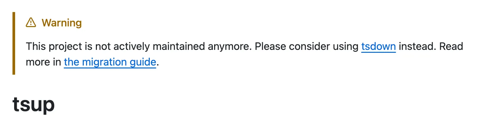
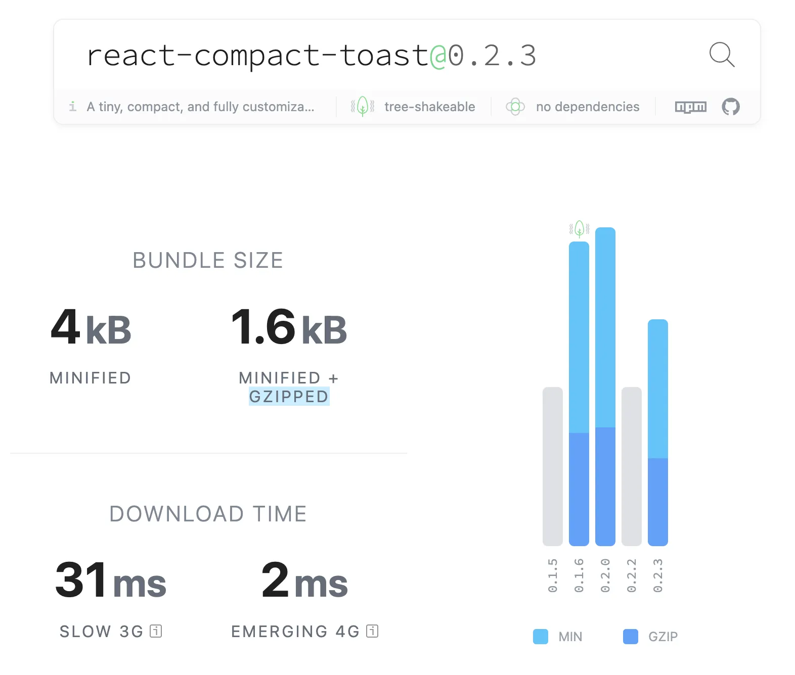

{/*  */}

라이브러리의 성능과 개발 경험(DX)은 번들러 선택 하나로 크게 달라질 수 있어요.

특히 TypeScript로 라이브러리를 개발할 때는 ESM, CJS 등 여러 포맷 지원부터 타입 선언 파일, 트리쉐이킹, 소스맵 등 신경 써야 할 부분이 정말 많아요.

> **"어떤 번들러를 선택해야 할까?"**
>
> 이번 포스트에서는 tsup에서 tsdown으로 마이그레이션하며 얻은 **24% 번들 크기 감소** 경험을 공유해보려 해요.

## 1. tsup의 유지보수 중단

[react-compact-toast](https://github.com/m2na7/react-compact-toast)를 제작할 당시, 저는 간편하고 빠르다는 이유로 **tsup**을 도입해 빌드 파이프라인을 구축했어요.

esbuild 기반으로 제공하는 빠른 빌드 속도와 쉽고 명확한 설정 등의 기능이 개발자 경험을 크게 향상시켰어요.

하지만, **2025년 8월 tsup의 공식 저장소에서 "거의 유지보수 중단"이 선언됐어요.**  
maintainer가 tsup 프로젝트를 더 이상 적극적으로 유지 보수하지 않을 것이라고 리드미에 명시했어요.


_tsup README_

더이상 유지보수가 적극적으로 진행되지 않는 라이브러리는 사용하지 않는 것이 좋다고 생각해요.  
버그나 보안 취약점이 발견돼도 빠른 시일 내에 해결되지 않을 수 있고, 업데이트나 호환성 문제에도 대응하기가 어렵기 때문이에요.

## 2. tsdown, 차세대 번들러의 등장

tsup의 리드미를 보면 maintainer가 **tsdown**으로 마이그레이션을 권장하고 있어요.  
이 소식을 접한 후, 저는 고민 없이 tsdown으로 마이그레이션을 결정했어요.

tsdown의 핵심 특징으로는

**1. Rust 기반 고성능**

- Rust로 작성된 Rolldown 엔진 내장
- 빌드 속도가 빠르고 번들 크기 최적화에 강점

**2. 넓은 호환성**

- Rollup/Vite 생태계와 호환
- tsup과 거의 동일한 설정 사용 가능

**3. 간편한 마이그레이션**

```bash
npx tsdown migrate
```

한 줄의 커맨드만으로 마이그레이션이 가능하고, 기존 tsup 설정을 거의 그대로 사용할 수 있어요.

**4. watch 모드 지원**

개발 과정에서 파일 변경 시 빠른 리빌드를 지원해요.

```bash
# 개발 모드로 실행
npx tsdown build --watch
```

## 3. 기본 설정 파일(tsdown.config.ts)

tsdown의 설정은 매우 직관적이에요. 기본적인 `tsdown.config.ts` 파일 예시를 살펴볼게요.

**간단한 설정 예시**

```typescript
// tsdown.config.ts
import { defineConfig } from 'tsdown'

export default defineConfig({
  entry: 'src/index.ts',
  format: ['esm', 'cjs'],
  dts: true,
  clean: true, // Default
  treeshake: true, // Default
  sourcemap: true,
  minify: true,
  outDir: 'dist',
  target: 'es2020',
})
```

**주요 옵션 설명**

- `entry`: 번들링의 시작점 (배열로 여러 파일 지정 가능)
- `format`: 출력할 모듈 형식 (`['cjs', 'esm']`로 CommonJS와 ES Module 동시 지원가능 Default - 'esm')
- `dts`: TypeScript 타입 선언 파일(.d.ts) 자동 생성
- `clean`: 빌드 출력물 정리 (Default - true)
- `treeshake`: 사용되지 않는 코드 제거 (Default - true)
- `sourcemap`: 디버깅을 위한 소스맵 파일 생성
- `minify`: 코드 압축 (공백, 주석 등 제거)
- `outDir`: 빌드 출력물이 생성될 디렉토리
- `target`: 타겟 버전 (ECMAScript, 브라우저, Node.js 등)

## 4. tsdown 마이그레이션 결과

간단한 세팅에 비해 실제 마이그레이션 후 결과는 기대 이상이었어요.

### 빌드 속도 개선

- 평균 빌드 시간이 2.4초에서 1.8초로 25% 단축됐어요.

### 번들 크기 대폭 감소

기존 약 **2.2KB(gzipped)에서 1.6KB**로 대폭 감소했어요.

```bash
tsup 기준
├── dist/index.js     → 2.28KB
└── dist/index.mjs    → 2.28KB

tsdown 기준
├── dist/index.js     → 1.76KB (22.6% 감소)
└── dist/index.mjs    → 1.51KB (33.7% 감소)
```


_[bundlephobia](https://bundlephobia.com/package/react-compact-toast@0.2.3)_

빠르게 변화하는 웹 개발 시장속에서 TypeScript 라이브러리 번들러도 빠르게 변하고 있어요.  
**tsdown**은 성능, 속도, 유지보수, 미래 호환성 모든 측면에서 tsup의 완벽한 후속 제품이라고 생각해요.

tsup 유지보수 중단 선언 이후, [react-compact-toast](https://github.com/m2na7/react-compact-toast) 라이브러리는 tsdown 덕분에 **24% 더 가볍고 더 빠른 번들**로 리뉴얼할 수 있었어요.
