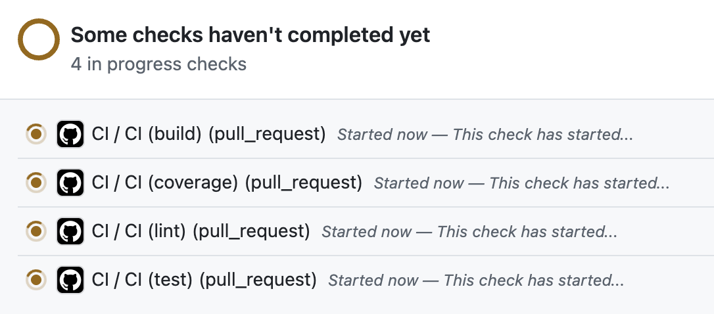

{/*  */}

최근 진행하고있는 confeti 프로젝트는 모노레포로 구성되어 있어요.  
프로젝트 규모가 커지면서 CI 빌드 시간이 점점 늘어나는 문제가 발생했는데,
작은 수정 사항조차 빌드에 오랜 시간이 걸리면서 개발 경험(DX)이 저하되는 상황이었어요.

> **"어떻게 하면 빌드 시간을 줄일 수 있을까?"**
>
> 이번 포스트에서는 **Turborepo**와 **GitHub Actions Matrix Strategy**를 활용해 CI 빌드 시간을 단축한 과정을 공유해보려 해요.

## 1. 기존 CI의 문제점

### 순차 실행의 한계

기존 워크플로우는 전형적인 순차 실행 방식이었어요.

```yaml
# 이전 방식 (순차 실행)
jobs:
  build:
    runs-on: ubuntu-latest
    steps:
      - name: Checkout repository
        uses: actions/checkout@v4

      - name: Setup Pnpm
        uses: pnpm/action-setup@v4

      - name: Set up Node.js
        uses: actions/setup-node@v4
        with:
          node-version: '20'
          cache: 'pnpm'

      - name: Install dependencies
        run: pnpm install --frozen-lockfile

      - name: Run tests
        run: pnpm test

      - name: Build project
        run: pnpm build
```

이와 비슷한 CI 워크플로우 파일이 CI, 크로마틱 배포, 커버리지 측정 등 각각 별도로 작성되어 있었고,
각 파일마다 동일한 설정(node.js 설정, pnpm 설치, 의존성 설치)이 중복 작성되어 있었어요.

**실제 파일 구조**

```bash
.github/workflows/
├── ci.yml             # 기본 CI (test + build)
├── chromatic.yml      # 스토리북 배포
└── test-coverage.yml  # 코드 커버리지 (test + coverage 리포트 작성)
```

해당 구조는 다음과 같은 문제가 있었어요.

**1. 순차 실행으로 인한 시간 낭비**

**2. 분산된 워크플로우 관리**

- 매번 새로운 검사 도구를 추가할 때마다 새 워크플로우 파일 생성
- 기본 설정 약 30줄 정도 복붙하고 특정 커맨드 1-2줄만 변경하는 작업이 반복됨
- 유지보수 시 모든 파일을 개별 수정해야 함(버전 업데이트시 각 파일을 수정해야 함)

**3. 개발자 경험 저하**

- GitHub Actions 탭에서 상태 파악이 어려움(모두 분리되어 있어서)
- 어떤 검사가 실패했는지 찾기 위해 여러 탭을 확인해야 함

## 2. 반복되는 액션 분리

```yaml
# .github/actions/pnpm-setup-node/action.yml

name: 'Setup pnpm and Node.js'
description: 'Setup pnpm and Node.js'

runs:
  using: 'composite'
  steps:
    - name: Setup pnpm
      uses: pnpm/action-setup@v4

    - name: Setup Node.js
      uses: actions/setup-node@v5
      with:
        node-version-file: '.nvmrc'
        cache: 'pnpm'
```

우선 반복되는 기본 세팅(node.js, pnpm 설치)을 별도의 액션으로 분리했어요.  
pnpm은 package.json에 명시된 버전을 설치하도록 설정했고,
node.js는 .nvmrc 파일에 명시된 버전을 설치하도록하여 일관성을 유지할 수 있도록 했어요.

## 3. GitHub Actions Matrix Strategy 적용

이후에는 병렬 처리를 도입해 빌드 시간을 단축하고, 워크플로우 파일을 간소화할 수 있었어요.

```yaml
name: CI

on:
  pull_request:
    branches: [develop, main]
  push:
    branches: [develop, main]

# 동시성 제어 설정(동일 브랜치 중복 실행 방지)
concurrency: ${{ github.workflow }}-${{ github.ref }}

jobs:
  ci:
    name: CI
    runs-on: ubuntu-latest
    strategy:
      matrix:
        command: ['lint', 'test', 'build', 'coverage']

    steps:
      - name: Checkout repository
        uses: actions/checkout@v5

      # 별도로 분리한 action 사용
      - name: Setup pnpm and Node.js
        uses: ./.github/actions/pnpm-setup-node

      # Turborepo Remote Caching 사용
      - name: Cache TurboRepo
        uses: actions/cache@v4
        with:
          path: .turbo
          key: ${{ runner.os }}-turbo-${{ matrix.command }}-${{ github.sha }}
          restore-keys: |
            ${{ runner.os }}-turbo-${{ matrix.command }}-
            ${{ runner.os }}-turbo-

      - name: Install dependencies
        run: pnpm install --frozen-lockfile

      # 커맨드 실행(lint, test, build, coverage)
      - name: Run ${{ matrix.command }}
        run: pnpm ${{ matrix.command }}

      # 조건부 코드 커버리지 업로드
      - name: Upload coverage to Codecov
        if: matrix.command == 'coverage' # coverage 커맨드일 때만 실행
        uses: codecov/codecov-action@v5
        with:
          token: ${{ secrets.CODECOV_TOKEN }}
```

실행 커맨드 뿐만 아니라 다음과 같이 os, node version 등도 matrix를 활용해 병렬 처리할 수 있어요.

```yaml
jobs:
  test-job:
  	runs-on: ${{ matrix.os }}
    strategy:
      matrix:
      	os: [ubuntu-latest, window-latest]
         node-version: [16, 18, 20]
```

이제 PR을 올려보면 각각의 command 별로 워크플로우가 실행되는 것을 확인할 수 있어요.


## 4. 조건부 트리거 설정

기존에는 모든 PR에서 스토리북 배포 워크플로우가 실행돼, 디자인 시스템 변경이 없어도 불필요하게 빌드가 돌았어요.
이를 해결하기 위해 디자인 시스템 패키지에 변경이 있을 때만 워크플로우가 실행되도록 설정해, 불필요한 빌드를 줄이고 CI 효율을 높였어요.

다음과 같이 path 조건을 활용하면 경로 기반 트리거를 설정할 수 있어요.

```yaml
name: 'Chromatic Publish'

on:
  pull_request:
    branches: [develop]
    paths:
      - 'packages/design-system/**' # 디자인 시스템 패키지 변경시만 실행
```

## 5. Turborepo Remote Caching적용

이제 Turborepo 캐싱에 대해서 알아볼게요.  
Turborepo를 도입한 이유 중 하나가 강력한 캐싱 기능이었지만, 기존에는 이 기능을 제대로 활용하지 못했어요.
기본적으로 제공되는 Local Cache만 사용했고, CI 환경에서는 별도의 캐시를 적용하지 않았기 때문이에요.

Remote Cache(원격 캐시)를 사용하면 CI 환경에서도 캐싱을 활용할 수 있어요.  
Turborepo Remote Cache를 사용하는 방법은 크게 세 가지가 있어요.

**1. Vercel을 활용해 캐시 서버 구축**

- 모든 플랜에서 무료로 사용 가능(Turborepo를 만든 회사가 Vercel인 덕분에..)

**2. Remote Cache 오픈소스 사용**

- S3 또는 다른 클라우드 서비스에 캐시 데이터 저장 가능
- [ducktors/turborepo-remote-cache](https://github.com/ducktors/turborepo-remote-cache), [Tapico/tapico-turborepo-remote-cache](https://github.com/Tapico/tapico-turborepo-remote-cache), [rharkor/caching-for-turbo](https://github.com/rharkor/caching-for-turbo) 등이 있음

**3. GitHub Actions에서 Remote Caching 사용**

- 가장 간단, CI에 GitHub Actions만 사용하는 경우

<br />

저는 이중에서 3번째 방법을 선택했어요.
CI로는 Github Actions외에 다른 도구를 사용하지 않기에 가장 간단하게 구축할 수 있었어요.

추후에 캐시 저장 제한에서 문제가 발생하거나,
고급 캐시 관리 기능이 필요하다면 Vercel을 활용해 캐시 서버를 구축해보려고 해요.

Github Actions에서 Turborepo Remote Caching을 적용하기 위해서는 기존 CI 워크플로우 파일에 다음과 같이 캐시 설정을 추가하면 돼요.

```yaml
- name: Cache TurboRepo
  uses: actions/cache@v4
  with:
    path: .turbo
    key: ${{ runner.os }}-turbo-${{ matrix.command }}-${{ github.sha }}
    restore-keys: |
      ${{ runner.os }}-turbo-${{ matrix.command }}-
      ${{ runner.os }}-turbo-
```

이제 Actions의 Caches 탭을 들어가보면 각 command 별로 캐시가 저장되어 있는 것을 확인할 수 있어요.


## 6. 성능 개선 결과

동일한 PR에 대해서 빌드 시간을 비교해보았어요.

### Remote Cache 미적용


약 19.6초 소요됐어요.

### Remote Cache 적용


동일한 PR의 경우 cache hit으로 인해 빌드 시간이 거의 0초에 가까웠어요.

> 곧 평균적인 CI 빌드 시간을 비교해보고 얼만큼의 개선이 이루어졌는지 공유해볼게요. ㅎㅎ
