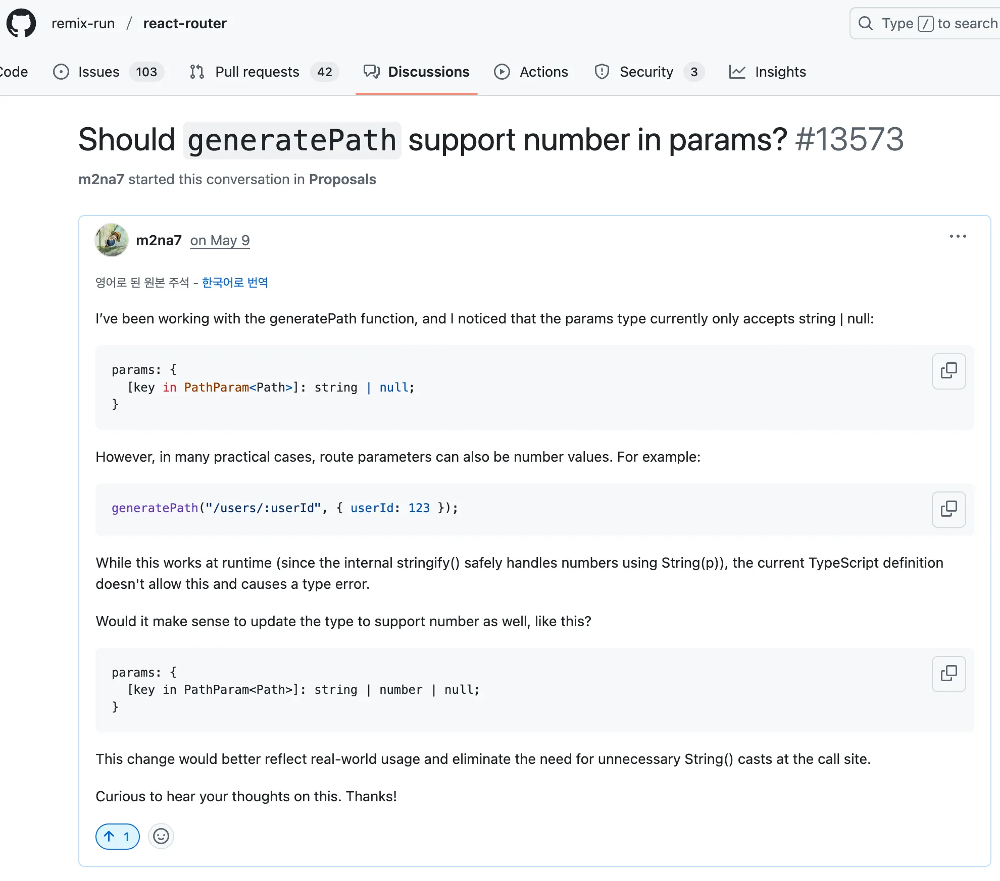

TypeScript로 코드를 작성할 때, 항상 고민되는 질문이 있습니다.

> "얼마나 안전하게 타입을 사용할 것인가?"
>
> **"그리고 개발자 경험(DX)을 해치지 않으면서도 이를 실현할 수 있을까?"**

저는 confeti 프로젝트에서 React Router로 동적 라우팅을 구성할 때 **타입 안정성과 개발자 경험(DX)** 사이의 균형을 고민했고, 이에 대해 구조적으로 개선한 경험을 공유해보려 해요.

## 1. **우선 라우트를 타입으로 다뤄보자.**

보통 라우트를 상수로 정의할 때

```tsx
export const routePath = {
  USER_DETAIL: '/users/:userId',
}
```

해당 방식을 많이 사용할 텐데, 이 객체는 내부적으로 다음과 같은 타입으로 추론돼요.

```tsx
const routePath = {
  USER_DETAIL: string;
};
```

이렇게 되면 유니온 타입을 추출하거나 자동완성, 경로에 따른 파라미터 매핑 등이 모두 **불가능**해져요.

즉, `"users/:userId"`라는 구체적인 경로 정보가 타입 시스템에서 사라지기 때문에, 이후 **경로를 기반으로 타입 유추를 하기가 어려워요.**

이를 해결하기 위해 필요한 것이 바로 `as const`입니다 !

```tsx
export const routePath = {
  USER: '/users',
  USER_DETAIL: '/users/:userId',

  CONCERT_DETAIL: '/concert-detail/:typeId',
  FESTIVAL_DETAIL: '/festival-detail/:typeId',
} as const

// 유니온 타입 생성
export type Routes = (typeof routePath)[keyof typeof routePath]
// → "/users" | "/users/:userId" | "/concert-detail/:typeId" ...
```

`as const`를 붙이면 객체 내부의 모든 값이 **readonly한 리터럴 타입**으로 고정돼요.

`"/users/:userId"`는 이제 `string`이 아니라`"/users/:userId"`**라는 정확한 타입**이 되었고, 위에 작성한 `type Routes` 처럼 전체 유니온 타입을 만들 수 있어요.

## 2. 동적 라우트에서 파라미터 타입을 추출해보자

라우트 경로는 `:userId`, `:postId`와 같은 동적 세그먼트를 가질 수 있어요.

이제 이를 **타입으로 추출**하면 더 안전하게 라우트를 사용할 수 있을 거예요.

```tsx
type PathParam<Path extends string> =
  Path extends `${string}:${infer Param}/${infer Rest}`
    ? Param | PathParam<`/${Rest}`>
    : Path extends `${string}:${infer Param}`
      ? Param
      : never

type Example = PathParam<'/users/:userId/posts/:postId'>
// → "userId" | "postId"
```

이제 작성한 `PathParam` 타입을 바탕으로 type-safe한 동적 경로를 만들어주는 `buildPath` 함수를 만들어 봅시다.

다음과 같이 동작한다면 Best일 거예요.

```tsx
buildPath('/posts/:postId/comments/:commentId', {
  postId: 10,
  commentId: 5,
}) // ✅ "/posts/10/comments/5"

buildPath('/product/:productId', { productId: '1234' })
// ✅ "/product/electronics/1234"

buildPath('/users/:userId/:name', { name: 'confeti' })
// ❌ Error: Property 'userId' is missing

buildPath('/users/:userId/:name', { id: '1', name: 'confeti' })
// ❌ Error: Object literal may only specify known properties, and 'id' does not exist in type ...
```

하지만, 사실 이런 함수를 직접 만들지 않아도 됩니다!

React Router는 이미 내부적으로 이런 역할을 하는 `generatePath` 함수를 제공하며,
`PathParam` 유틸리티 함수도 내부적으로 정의되어 있어요.

## 3. **generatePath와 함께하는** Type-safe**한 URL 생성**

React Router에서 제공하는 `generatePath` 함수는
경로 템플릿(예: `"/users/:userId"`)에 파라미터 객체를 넣어 실제 URL 문자열을 생성해주는 역할을 해요.


_https://v5.reactrouter.com/web/api/generatePath_

그런데 이 함수 자체는 파라미터 타입이 문자열 기반이긴 해도, 우리 프로젝트에서 미리 정의한 라우트 타입과 직접 연결되어 있지 않아 완전한 타입 안정성을 보장하지 못해요.

이를 보완하기 위해, 프로젝트 내 라우트 타입(`Routes`)과 함께 사용할 수 있도록 `generatePath`를 **래핑한** `buildPath` **함수**를 만들어 봤어요.

```tsx
import { generatePath } from 'react-router'

import { type Routes } from '@shared/router/path'

export function buildPath<P extends Routes>(
  ...args: Parameters<typeof generatePath<P>>
): string {
  return generatePath(...args)
}
```

이렇게 하면 다음과 같은 타입 안전성이 생겨요.

```tsx
export const routePath = {
  USER: '/users',
  USER_DETAIL: '/users/:userId',
  CONCERT_DETAIL: '/concert-detail/:typeId',
} as const

const URL = buildPath(routePath.CONCERT_DETAIL, { typeId }) // ✅

const URL = buildPath('/concert-detail/:typeId', { typeId }) // ✅

const URL = buildPath(routePath.CONCERT_DETAIL, { userId })
// ❌ 개체 리터럴은 알려진 속성만 지정할 수 있으며 '{ typeId: string; }' 형식에 'userId'이(가) 없습니다.

const URL = buildPath('/concert-details/:typeId', { typeId })
// ❌ "/concert-details/:typeId"' 형식의 인수는 'Routes' 형식의 매개 변수에 할당될 수 없습니다.
```

## 4. **왜** **generatePath** **는** **string** **만을 허용할까?**

하지만 여기서 불편한 점이 하나 있습니다.

```tsx
const URL = buildPath('/concert-detail/:typeId', { typeId: 123 })
// ❌ 컴파일 에러 — 'id'는 string이어야 함

const URL = buildPath('/concert-detail/:typeId', { typeId: String(typeId) })
// ✅
```

`number` 타입의 ID를 그대로 넘기면 컴파일 에러가 발생해요. 런타임에선 잘 작동하지만, 타입스크립트는 이를 허용하지 않아요.


_react-router Discussions_

처음에는 왜 `string`만을 허용하는지 의문이 커서 Discussion을 남기기도 했어요.

<br />
자세히 찾아보니 이전부터 저와같은 고민을 했던 분들이 있었어요.


_https://github.com/remix-run/react-router/discussions/10393_

그리고 **TypeScript-DOM-lib-generator** 에서도 유사한 토론을 나눈 것을 확인할 수 있었어요.

이에 대해 조금 더 알아본 결과, URL은 본질적으로 **문자열 기반 시스템**이라는 점을 깨닫게 되었어요.
[MDN URL API 문서](https://developer.mozilla.org/ko/docs/Web/API/URL)

React Router 팀은 `generatePath` 함수의 파라미터 타입을 `string`으로 제한했는데, 이는 단순한 제약이 아니라 웹 URL 시스템의 본질을 반영한 설계에요.

- `window.location.pathname` → 항상 `string`
- `new URL().pathname` → 항상 `string`
- `encodeURIComponent()` → `string`만 받음

React Router는 이러한 웹의 규칙을 따르고자 **명시적으로** `string`**만 허용**한 것이에요.

## 5. 하지만 실제 프로젝트(confeti)에서는

confeti 프로젝트에서는 서버 API로부터 받아오는 대부분의 `id` 값이 `number` 타입이에요.

그리고 매번 이 값을 명시적으로 `string`으로 변환해주는 작업은 꽤 번거로운 보일러플레이트로 느꼈어요.

이런 반복적인 변환 과정은 **개발자 경험(DX)을 저하시킨다고 생각했어요.**

그래서 다음과 같이, `buildPath` 래퍼함수 내에서 `number` 타입도 허용하되 내부에서 자동으로 `string`으로 변환해주도록 했어요.

```tsx
export const buildPath = <P extends Routes>(
  path: P,
  params: { [key in PathParam<P>]: string | number }
): string => {
  const convertedParams = Object.entries(params).reduce(
    (acc, [key, value]) => {
      acc[key as PathParam<P>] = String(value)
      return acc
    },
    {} as { [key in PathParam<P>]: string }
  )

  return generatePath(path, convertedParams)
}
```

이렇게 하면 내부에서 타입 변환을 책임져주기 때문에, **호출하는 쪽에서는 더 간결하고 직관적인 코드를 작성할 수 있어요.** (`number` 타입 드디어 허용...)

즉, 타입 안정성을 유지하면서도 개발자의 편의성을 높인 셈이에요.

```tsx
buildPath(routePath.CONCERT_DETAIL, { typeId: 123 })
// ✅ → "/concert-detail/123"

buildPath(routePath.USER_DETAIL, { userId: '456' })
// ✅ → "/users/456"

buildPath('/users/:userId/:name', { userId: 1, name: 'confeti' })
// ✅ → "/users/1/confeti"
```

> React Router는 웹의 원칙과 타입 안정성을 잘 지키도록 설계되어있어요.
>
> 하지만 실제 개발 환경에서는 **엄격한 타입 시스템이 개발 흐름을 방해할 수도** 있어요.
>
> 결국 중요한 건 **안전성과 생산성 사이에서 적절한 균형을 찾는 것**이에요. 이처럼 작은 래퍼 함수 하나로 팀에 맞는 경험을 만들어보는 것도 충분히 가치 있다고 생각해요.
